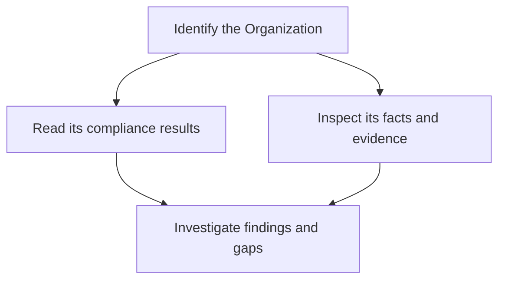

## Base URL

```text
https://api.alignr.io/api/v1
```

The REST API uses JSON and bearer authentication. Start with a key granting `organization.read`.

## List your Organizations

Store your API key in the `ALIGNR_API_KEY` environment variable through your secret manager or shell environment, then run:

```bash
curl --fail-with-body \
  'https://api.alignr.io/api/v1/organizations?page=1&pageSize=20' \
  --header "Authorization: Bearer $ALIGNR_API_KEY"
```

The response contains an `items` array and pagination metadata. Use an Organization’s `id` in requests that require a client identifier. An empty `items` array can be a valid result; it does not prove the workspace is fully configured.

## Next steps

<Columns cols={2}>
  <Card title="Authentication" icon="key" href="/api-reference/authentication">Understand API keys and permissions.</Card>
  <Card title="Live API schema" icon="code" href="/api-reference/live-schema">Retrieve the reference for your running deployment.</Card>
</Columns>

## Understand the data you retrieve

Organizations provide client context. Facts describe observations. Standards and controls describe expectations. Detections describe findings. These objects answer different questions; listing no detections does not prove that all controls passed.



When working with facts, translate the predicate using the [reference](/guides/predicate-reference), then check subject identity, source and observation time. Preserve technical identifiers in your integration; readable labels are for presentation.

## Build a useful client integration

Start with read-only requests and least-privilege scopes. Handle pagination, distinguish permission errors from empty data, and keep the Organization context explicit across requests. Follow the generated operation's documented query parameters rather than guessing a common filter name.

For a recurring report, retain the evaluation time and evidence context alongside each status. A report without those details can make an old or incomplete assessment look current.
