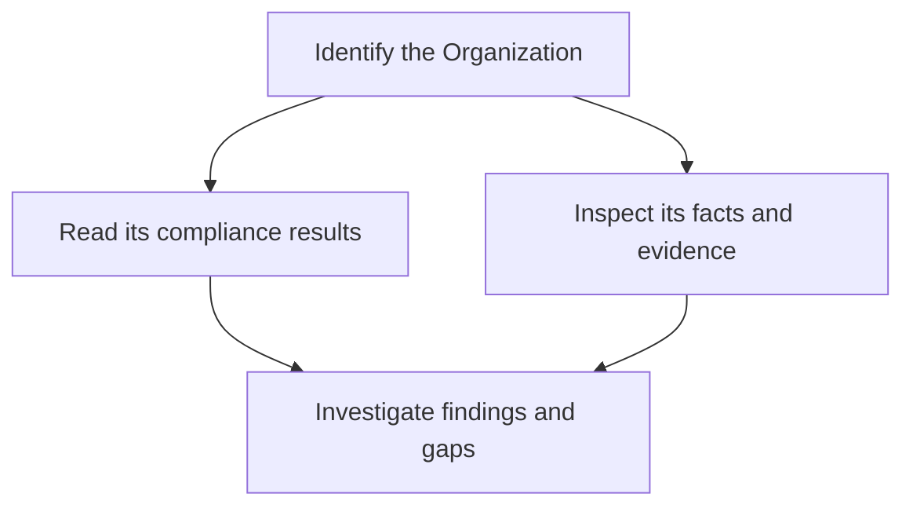

Use the REST API to build scripts, reports and integrations with Alignr data. A user-owned API key can also manage client records through three scoped Organization write operations. You can use Alignr in the app without creating an API key.

<Tip>Open the [Developer Console](https://app.alignr.io/developer) while signed in to browse this deployment's endpoint reference and try requests using your session or, where supported by the endpoint, a scoped API key. **Try it sends real requests to your workspace**; it is not an isolated test environment. Review a write request before confirming it.</Tip>

## Before you begin

[Create an API key](/guides/api-keys) with `organization.read`, then store it in the `ALIGNR_API_KEY` environment variable through your secret manager or shell environment.

## Base URL

```text
https://api.alignr.io/api/v1
```

The REST API uses JSON and bearer authentication.

## List your Organizations

Run this read-only request to find the clients in your MSP workspace:

```bash
curl --fail-with-body \
  'https://api.alignr.io/api/v1/organizations?page=1&pageSize=20' \
  --header "Authorization: Bearer $ALIGNR_API_KEY"
```

The response contains an `items` array and pagination metadata. Use an Organization’s `id` in requests that require a client identifier. An empty `items` array can be a valid result; it does not prove the workspace is fully configured.

## Understand the data you retrieve

Organizations provide client context. Facts describe observations. Standards and controls describe expectations. Detections describe findings. These objects answer different questions; listing no detections does not prove that all controls passed.



When working with facts, translate the predicate using the [reference](/guides/predicate-reference), then check subject identity, source and observation time. Preserve technical identifiers in your integration; readable labels are for presentation.

## Build a useful client integration

Start with read-only requests and least-privilege scopes. Handle pagination, distinguish permission errors from empty data, and keep the Organization context explicit across requests. Follow the generated operation's documented query parameters rather than guessing a common filter name.

For a recurring report, retain the evaluation time and evidence context alongside each status. A report without those details can make an old or incomplete assessment look current.

## Continue building

<Columns cols={2}>
  <Card title="Authentication" icon="key" href="/api-reference/authentication">Understand API keys and permissions.</Card>
  <Card title="Pagination" icon="list" href="/api-reference/pagination">Retrieve more than the first page of results.</Card>
  <Card title="Errors" icon="circle-exclamation" href="/api-reference/errors">Handle failed requests and retries.</Card>
  <Card title="Live API schema" icon="code" href="/api-reference/live-schema">Find the full reference for your deployment.</Card>
  <Card title="Manage clients" icon="building" href="/api-reference/manage-clients-recipe">Create, update and archive a client with a user key.</Card>
</Columns>
