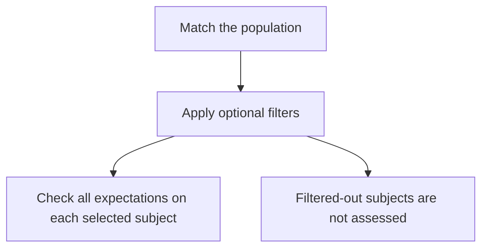

A control definition describes **which subjects to assess** and **what each one should satisfy**. The editor covers one population predicate and a recursively grouped expected state. More specific populations use the definition fields below.

This page explains the definition format, not a JSON-import button in the UI. For programmatic writes, consult your deployment's [live schema](/api-reference/live-schema) and required permissions; the public API catalogue is a curated read-only reference.

## Controls and standalone detection rules

These definitions describe controls within a standard. Their `match` and `where` select a population; `expect` describes what should hold for that population.

Standalone detection rules use different semantics: matching `match` and `where` identifies a candidate violation. For example, selecting enabled accounts is a useful control population, but using that selection alone as a standalone rule would flag enabled accounts as candidates—including healthy ones.

Do not copy a control population into a standalone rule and assume it still describes a passing requirement. Review the kind of rule and the question it is intended to answer before using its definition.

## Worked example: enabled accounts have MFA registered

```json
{
  "match": {
    "predicate": "account_enabled",
    "object": true
  },
  "expect": [
    { "fact": "mfa_registered", "op": "eq", "value": true }
  ],
  "severity": "high",
  "title": "Enabled accounts have MFA registered",
  "evidence": ["account_enabled", "mfa_registered"]
}
```

In plain English: **select accounts observed as enabled, then check that each selected account is observed as registered for MFA**. This does not prove MFA enforcement at sign-in.

`match.object` is an exact population value. Omitting it selects subjects with an `account_enabled` observation regardless of whether the observed value is true or false.

## Combine expected conditions

The `expect` value may keep its existing flat list, which means all listed conditions must hold. To express alternatives, use a group object with exactly one `all` or `any` key and a non-empty list of children. A child is another group or a leaf in the existing `{ "fact", "op", "value" }` form.

For example, this accepts a disabled account or an enabled account with a registered MFA method:

```json
{
  "match": { "predicate": "account_enabled" },
  "expect": {
    "any": [
      { "fact": "account_enabled", "op": "eq", "value": false },
      {
        "all": [
          { "fact": "account_enabled", "op": "eq", "value": true },
          { "fact": "mfa_registered", "op": "eq", "value": true }
        ]
      }
    ]
  },
  "severity": "high",
  "title": "Enabled accounts have MFA registered",
  "evidence": ["account_enabled", "mfa_registered"]
}
```

The outer `any` means either child may satisfy the expectation; the nested `all` requires both conditions for that alternative. The example tests registration only. It does not prove MFA enforcement or a successful challenge.

The editor preserves a flat array for the common single-condition case. Multiple conditions are saved as a root `{ "all": [...] }` or `{ "any": [...] }` group. Reordering children changes their display and saved order, not the logic: every `all` child remains required and any true `any` child is sufficient.

Groups must be non-empty. The root must be an `all`/`any` group when grouped form is used; a nested group contains exactly one operator key. The definition allows at most 8 group levels and 64 total nodes, counting groups and leaves. The editor validates these limits before saving. Standalone detection rules keep their existing flat parser and do not accept grouped `expect` trees.

## Missing, false and stale evidence

Grouped conditions use three outcomes for each leaf: true, false or unknown. In an `all` group, any known false child makes the group false; it is true only when every child is true; otherwise it is unknown. In an `any` group, any known true child makes the group true; it is false only when every child is false; otherwise it is unknown.

An absent observation remains unknown. It is not a false value and does not make `not_exists` true. Stale or ineligible evidence also cannot make a control pass. A known true `any` branch can decide the result even when an unused alternative has no source; inspect the preview's source gaps to understand that limitation. A missing condition needed by every path remains unknown or not covered, never passing evidence.

## Add filters only when they express the intended scope

`where` narrows the matched subjects before the expectations run. For example, the seeded dormant-account control starts from subjects with an account-enabled observation, filters for sign-ins older than its configured limit, and expects those accounts to be disabled. `where` remains an implicit-AND list; nested grouping applies to `expect`.

A filter is not another requirement. If you filter for healthy devices first, unhealthy devices can disappear from the assessed population instead of failing the control. Put a condition in `expect` when failure to satisfy it should count as a failure.



Subjects outside the selected population are not evidence of passing. Missing observations in filters also need a coverage review; do not assume the remaining population represents the entire client.

## Multiple values and subject identity

Every expectation leaf is evaluated against the exact subject selected by `match` and `where`. A source's display name does not join two different subject IDs. Keep separate controls when the requirements need different ownership, severity or follow-up.

Match anchors can select a member of a multiple-valued predicate, such as a particular role. `where` and `expect` comparisons use the latest selected fact; they do not automatically search every member of a set. Avoid describing them as “any role” or “all licences” unless the evaluator actually expresses that question.

## Missing is not a negative observation

`exists` checks a non-null observed value. `not_exists` checks an observed null value. An absent fact is unknown for these comparisons, just as it is for `neq` or `not_in`.

This matters for patch checks: the absence of `missing_patch` rows does not prove that no patches are missing. Use a source that supplies an explicit suitable status or retain the coverage gap. In a grouped expression, a known false child may still establish a failed `all` branch, and a known true child may establish a satisfied `any` branch; unknown children remain visible in the preview rather than being silently converted to false.

For the operator reference and an administrator MFA example, see [how control conditions work](/guides/control-conditions). Test [pass, fail, unknown and empty populations](/controls/test-and-rollout) before rollout.
