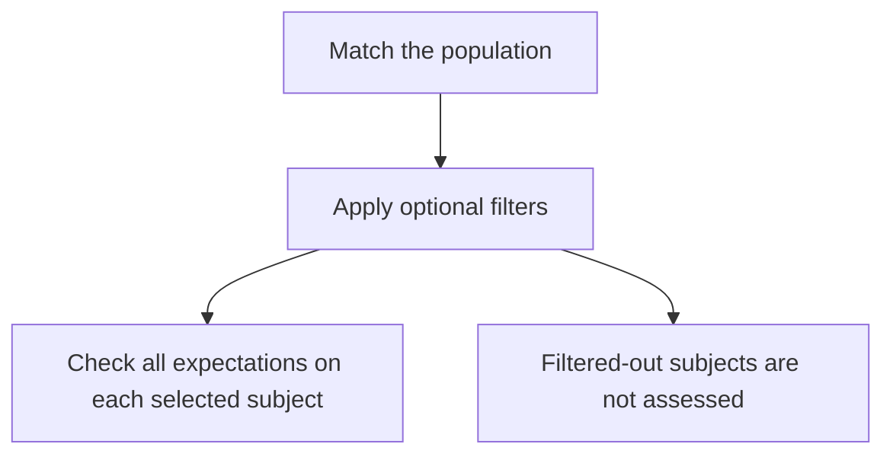

A control definition describes **which subjects to assess** and **what each one should satisfy**. The simple editor covers one population predicate and one expectation. More specific populations use the definition fields below.

This page explains the definition format, not a JSON-import button in the UI. For programmatic writes, consult your deployment's [live schema](/api-reference/live-schema) and required permissions; the public API catalogue is a curated read-only reference.

## Controls and standalone detection rules

These definitions describe controls within a standard. Their `match` and `where` select a population; `expect` describes what should hold for that population.

Standalone detection rules use different semantics: matching `match` and `where` identifies a candidate violation. For example, selecting enabled accounts is a useful control population, but using that selection alone as a standalone rule would flag enabled accounts as candidates—including healthy ones.

Do not copy a control population into a standalone rule and assume it still describes a passing requirement. Review the kind of rule and the question it is intended to answer before using its definition.

## Worked example: enabled accounts have MFA registered

```json
{
  "match": {
    "predicate": "account_enabled",
    "object": true
  },
  "expect": [
    { "fact": "mfa_registered", "op": "eq", "value": true }
  ],
  "severity": "high",
  "title": "Enabled accounts have MFA registered",
  "evidence": ["account_enabled", "mfa_registered"]
}
```

In plain English: **select accounts observed as enabled, then check that each selected account is observed as registered for MFA**. This does not prove MFA enforcement at sign-in.

For Microsoft account predicates, this ordinary population also applies the default Member scope described in [Identity and access](/controls/baselines/identity). Add an explicit structured `user_type` match or filter when a control is intended to assess Guests; missing or stale type evidence remains unknown and is not treated as Member.

`match.object` is an exact population value. Omitting it selects subjects with an `account_enabled` observation regardless of whether the observed value is true or false.

## Add filters only when they express the intended scope

`where` narrows the matched subjects before the expectations run. For example, the seeded dormant-account control starts from subjects with an account-enabled observation, filters for sign-ins older than its configured limit, and expects those accounts to be disabled.

A filter is not another requirement. If you filter for healthy devices first, unhealthy devices can disappear from the assessed population instead of failing the control. Put a condition in `expect` when failure to satisfy it should count as a failure.



Subjects outside the selected population are not evidence of passing. Missing observations in filters also need a coverage review; do not assume the remaining population represents the entire client.

## Multiple expectations and values

All expectation clauses must be satisfied for a subject to satisfy the control. Keep separate controls when the requirements need different ownership, severity or follow-up.

Match anchors can select a member of a multiple-valued predicate, such as a particular role. `where` and `expect` comparisons use the latest selected fact; they do not automatically search every member of a set. Avoid describing them as “any role” or “all licences” unless the evaluator actually expresses that question.

## Missing is not a negative observation

`exists` checks a non-null observed value. `not_exists` checks an observed null value. An absent fact is unknown for these comparisons, just as it is for `neq` or `not_in`.

This matters for patch checks: the absence of `missing_patch` rows does not prove that no patches are missing. Use a source that supplies an explicit suitable status or retain the coverage gap.

For the operator reference and an administrator MFA example, see [how control conditions work](/guides/control-conditions). Test [pass, fail, unknown and empty populations](/controls/test-and-rollout) before rollout.
