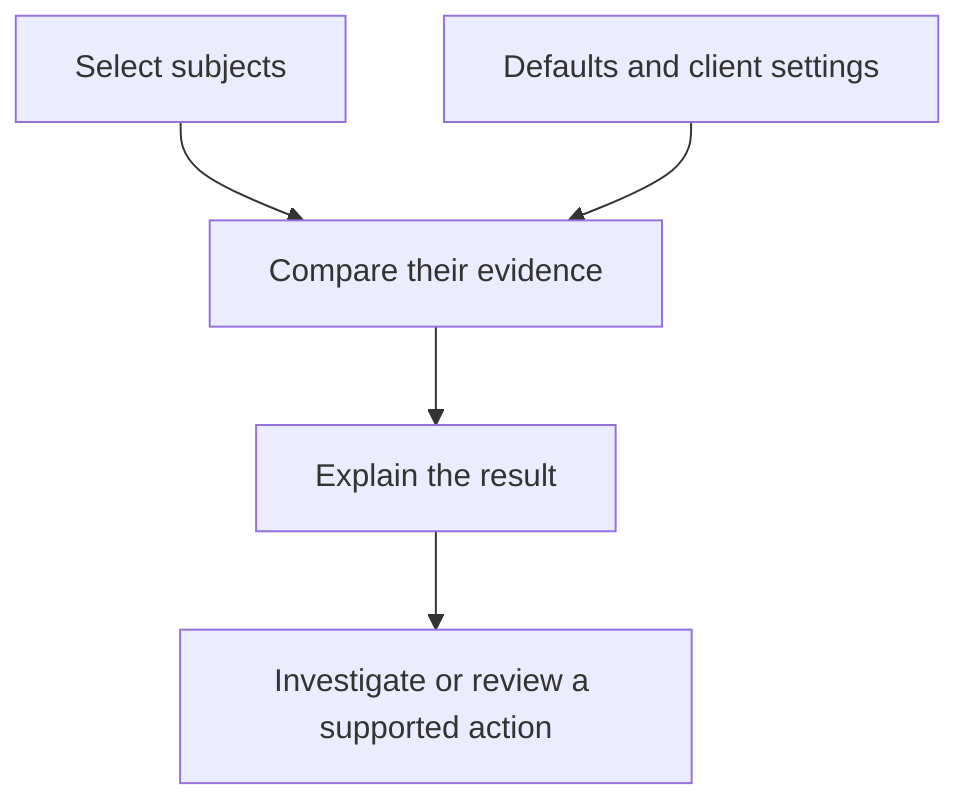

A control turns a technical expectation into a repeatable question. **“MDM-enrolled devices report encryption enabled”** is one question. **“We can recover the encryption key”** is another, usually requiring a manual review.

Start with the outcome you need, then choose evidence that can actually establish it.

<CardGroup cols={2}>
  <Card title="Choose a baseline" icon="layer-group" href="/controls/baselines/overview">Browse the supplied controls and manual checks in eight topic categories.</Card>
  <Card title="Create your own" icon="sliders" href="/controls/create-custom">Build a focused control using the editor and a worked example.</Card>
  <Card title="Tune client expectations" icon="gear" href="/controls/parameters">Understand defaults, typed parameters and client overrides.</Card>
  <Card title="Add human judgement" icon="clipboard-check" href="/controls/manual-checks">Define review instructions, record evidence and keep assessments current.</Card>
</CardGroup>

## The parts of a control

| Part | Plain-English meaning | Example |
| --- | --- | --- |
| Standard | The collection this control belongs to. | Endpoint health. |
| Population | The subjects the control assesses. | Devices with an MDM enrolment observation. |
| Additional filters | Narrow that population when needed. | Only a specified operating-system family. |
| Expectation | What each selected subject should satisfy. | Encryption is `true`. |
| Parameter | A named setting that can vary without rewriting the condition. | Maximum check-in age: two days. |
| Severity | How the finding is classified. | Medium. |
| Autonomy | The control's requested limit on supported follow-up actions. | Suggest only. |

A predicate names the observation, such as `device_encryption_enabled`. The control adds the question: **does that observation equal true?** See [predicates explained](/guides/predicates) if this terminology is new.

The control selects subjects and compares their observations with the effective settings. The result is an assessment; carrying out a change is a separate decision.

## Keep each expectation small

Prefer separate controls for encryption, patching and EDR installation. A broad name such as “device is secure” hides what you have measured and makes failures difficult to explain.

Automated controls need usable observations. A missing value is not `false`, a missing count is not zero, and no matching subjects is not a pass. Read [control results](/guides/control-status) before using a score to describe coverage.

## Choose your next step

Use the [custom control walkthrough](/controls/create-custom) for a simple condition, [advanced definitions](/controls/advanced-definitions) for filtered populations, and [testing and rollout](/controls/test-and-rollout) before enabling a new expectation across clients.
