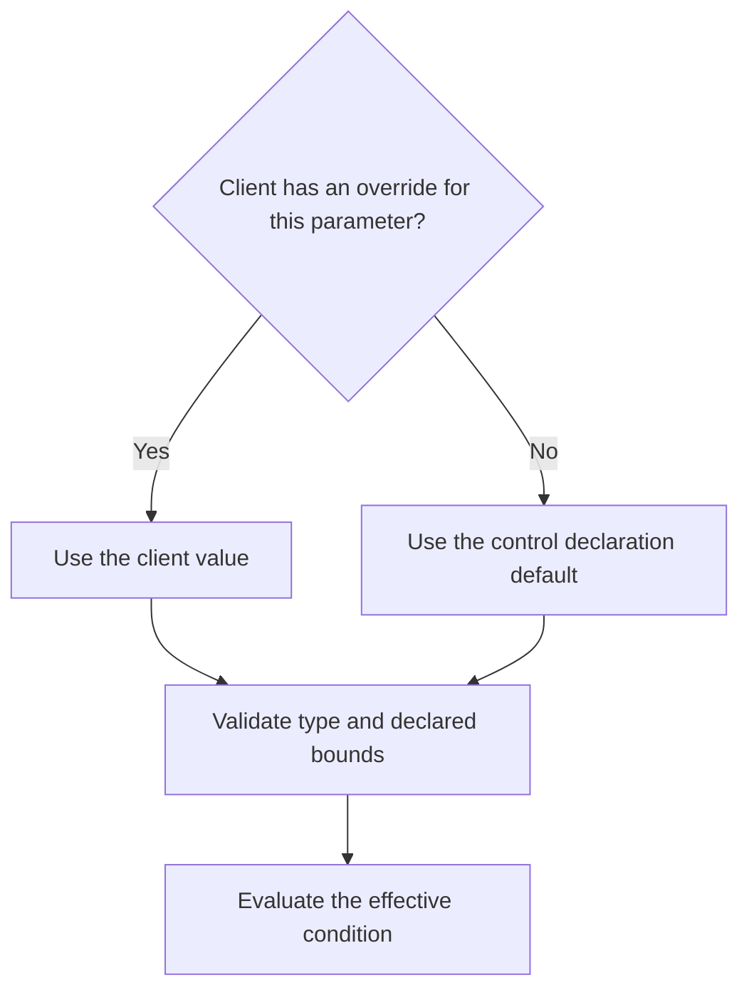

A parameter gives a comparison a named setting. Instead of writing “last check-in within two days” directly into a definition, use a parameter such as `days` whose default is `2`.

Parameters change the expectation. They do not create evidence, improve source coverage or authorise remediation.

## How a value is chosen

Resolution happens per parameter. A client override replaces that parameter's default; parameters without overrides retain their declared defaults.

| Setting | Example | Effect |
| --- | --- | --- |
| Control default | Check-in window: `2` days. | Used where no client override is set. |
| Client override | Check-in window: `3` days. | That client's condition uses three days. |
| Revised default | Change the default to `1` day. | Clients with an explicit three-day override retain it. |

Always read the effective setting alongside the evidence. A result against a three-day window does not establish compliance with a one-day expectation.

## Where to change a value

### Change the shared default

Open an editable standard and its **Controls** tab. In the control's **Parameters** column, edit the relevant value. Numeric and text values save when you leave the field; choices and toggles save when changed. Review any error message and confirm the saved value before running checks.

You need permission to edit controls. A system standard's shared defaults are locked; make an editable copy to change its contents.

### Set a client exception

Open the client's **Compliance** tab, find the control and open its row's actions menu. Select **Override value**, enter the client's threshold and select **Save override**. A control must declare a parameter before there is a value to override.

To return to the shared settings, use **Reset to standard** and review the confirmation. This removes the client-specific setting and restores the standard's default value **and enablement**.

## Declare the right type

| Editor type | Meaning | Example |
| --- | --- | --- |
| Integer | A whole-number count. | Maximum open findings: `5`. |
| True / false | A Boolean expectation. | Required state: `true`. |
| Text | An exact text value. | Expected state: `compliant`. |
| Choice | One of the declared options. | An agreed policy state. |
| Duration (days) | A duration used by a day-based comparison. | Check-in window: `2`. |

The declaration can include bounds or choices that constrain valid values. Built-in thresholds and ranges are listed in each [baseline category](/controls/baselines/overview). A parameter reference must name a declared parameter, and the value must be appropriate for its operator.

<Note>
The `within_days` comparison accepts a timestamp within the window before **or after** now. It is not a past-only recency assertion. Check unexpected future timestamps and clock issues.
</Note>

## Enabled state is a separate setting

A client control override can specify enabled state; otherwise the control's own enabled state applies. A disabled parent standard forces the control off, even if a client override requests it on.

Switching off a control changes assessment scope. It does not establish that the environment meets the expectation, and it should not be used to hide an unexplained coverage gap.

## Autonomy is also separate

The control's declared autonomy is only one limit. Effective autonomy is bounded by the rule, Organization contract, tenant and platform kill switch. Increasing a numeric threshold does not increase autonomy. Irreversible actions still require a named human approver.

## Change a threshold deliberately

1. Identify which clients inherit the default and which have overrides.
2. Record the business reason for the new expectation and any client exception.
3. Check the parameter type, bounds and comparison semantics.
4. Evaluate again and inspect evidence and effective settings.
5. Review failures and gaps separately from whether any remediation is appropriate.

Copy a protected system standard into an editable standard when changing its content. Keep the distinction between a shared default and a deliberate client override visible during review.
