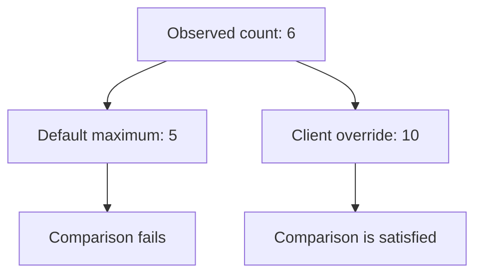

**Question:** is the source-reported open-vulnerability count at or below this client's agreed maximum?

In this fictional example, Acme's agreed maximum is **five**. Choose a threshold appropriate to your own client; a count alone does not measure the severity or business risk of its findings.

## Build the condition

Create the control in an editable standard using [Add control](/controls/create-custom). Keep it disabled while drafting.

| Editor field | Value |
| --- | --- |
| Name | Open vulnerability count stays within the agreed limit |
| Population predicate | `vulnerability_open_count` |
| Fact to verify | `vulnerability_open_count` |
| Operator | **at most** |
| Parameter name | `maximum` |
| Parameter type | **Integer** |
| Parameter label | Maximum open vulnerabilities |
| Parameter default | `5` |
| Value source | **Parameter default**, selecting `maximum` |

Choose a suitable severity and category. Use **Suggest only** autonomy while reviewing the behaviour. For the full creation workflow, see [Create a custom control](/controls/create-custom).

## Check the boundary, not just an easy example

| Recorded count | Maximum | Comparison |
| --- | --- | --- |
| `0` | `5` | Satisfied: zero is an observed count. |
| `5` | `5` | Satisfied: “at most” includes the limit. |
| `6` | `5` | Failed: the count exceeds the limit. |
| No observation | `5` | No assessment from this missing observation; it is not zero. |

These describe the comparison for a subject with eligible current evidence. The overall control also depends on its selected population and evidence coverage.

## See what an override changes

Suppose a recorded count is six. It fails against Acme's default maximum of five. If a deliberate client override sets the maximum to ten, that same count satisfies the new comparison.

**The environment did not improve. The expectation changed.** Record why the exception is appropriate and read the effective value alongside the result.

This diagram compares two configurations, not two simultaneous results. Alignr evaluates against the effective setting for that client. See [parameters and client overrides](/controls/parameters) for the editing and reset workflow.

## What this control cannot tell you

A low count does not establish that the remaining findings are low risk. Review severity, affected assets and scanner coverage separately. Counts from different scanner scopes may not be directly comparable.

**Checkpoint:** you can identify the recorded count, effective maximum, source and observation time, and explain why the comparison was satisfied or failed.

<Card title="Next: test and roll out the control" icon="arrow-right" href="/controls/test-and-rollout">Check representative evidence, missing observations and client settings before relying on the result.</Card>
