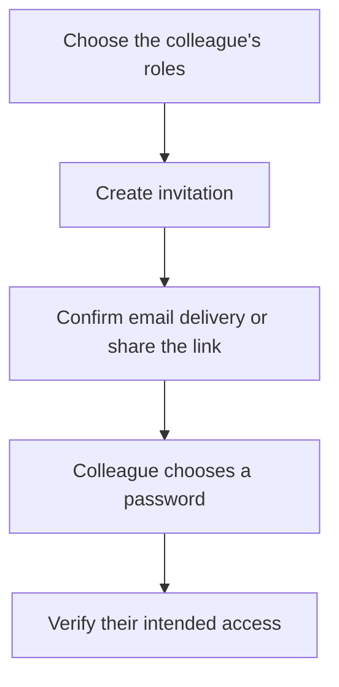

Use **Settings → Account** for your own profile and security. Use **Settings → Team members** to invite colleagues into your MSP workspace; the destination page is titled **Users**.

These accounts are your internal team. Client-facing access is configured separately through the client portal.

## Before you start

Viewing team members requires `user.read`; inviting or changing them requires `user.manage`. The invitation form also loads available roles, so the administrator needs access to read roles (`role.read`). Creating or changing a role requires `role.manage`.

If a settings link or action is missing, ask your workspace administrator to review your effective permissions. An account can hold several roles; their permissions combine.

## Invite a colleague

<Steps>
  <Step title="Open the invitation form">
    Open **Settings → Team members → Invite user**. Enter the colleague's **Full name** and **Email**.
  </Step>
  <Step title="Choose how they join">
    Leave **Create an invitation link** selected so the colleague chooses their own password. Under **Roles**, select the access they need, then select **Invite user**.

    A user without roles can sign in but has no role-granted access to workspace data. Review the intended role before inviting them.
  </Step>
  <Step title="Check delivery">
    Read the delivery message. **Invitation email sent** means the configured mail provider accepted the message; confirm the colleague receives it.

    If delivery is disabled or fails, use **Copy** in the invitation dialog and share the one-time link with the intended colleague through your approved channel. The readable link is shown once, so copy it before closing the dialog when you need to deliver it manually.
  </Step>
  <Step title="Confirm access">
    The colleague opens the invitation and chooses their password. Check that they can sign in and reach the pages their role is intended to grant.

    **Checkpoint:** the account appears in Users with the expected roles, and the colleague can complete their intended task.
  </Step>
</Steps>

Invitation links are single-use and expire after seven days. Treat the link as a credential.

Creating an account, delivering an invitation and verifying access are separate milestones. A saved user record alone does not complete onboarding.

### Recover a lost or expired invitation

Open the user's record and select **Re-issue invitation** where available. A replacement invalidates the previous link. Share only the latest invitation.

Reissuing is for someone who has not accepted their invitation or signed in. For an established user, use the account-management actions rather than trying to invite them again.

### Set an initial password when necessary

The invitation form also offers **Set a password now**. The password must contain at least 12 characters, and the colleague must replace it at first sign-in. Use your approved credential-sharing process; the invitation path lets the colleague choose a password you never know.

## Review and change access

Open a user and inspect the **Access** tab to see their roles and combined effective permissions. Select **Edit** to change their full name, roles or **Active** state, then **Save changes**. Email is shown but cannot be changed in this form.

- To remove access, use **Deactivate** or clear **Active** in the editor. You cannot deactivate your own account.
- To restore an inactive account, an authorised administrator can select **Active** in **Edit**.
- To set a replacement password, use **New password**. Leaving it blank preserves the existing password; setting one requires the person to replace it at their next sign-in.
- To change your own management permissions, ask another administrator. The app protects against removing your own user or role management access.

**Checkpoint:** reopen the user's record and review the saved roles, effective permissions and status.

## Create a role for a repeatable job

Open **Settings → Roles & permissions**, then **+ New role**. Give the role a clear name and description, and choose its permissions. For an existing custom role, open it and select **Permissions** to adjust its grants.

For example, a colleague who reviews evidence and reports results may need different access from the administrator who connects sources and edits standards. Choose permissions for their actual tasks rather than assigning every available permission.

System roles are protected: their names and permissions cannot be edited. A custom role's changes affect everyone who holds it, alongside any other roles they have. Review the role's users before changing its grants.

On the **Roles** list, search by role name or description, filter by **All roles**, **System** or **Custom**, and sort by name, number of users or number of granted permissions. Search and sorting apply across the roles available in your workspace before pagination; choose 25, 50 or 100 rows per page. Open a role to review its permissions, attached users and history.

## Manage your own account

Under **Settings → Account**, the profile card shows your name, email and role. **Edit profile** changes your name and requires `user.manage`; other users see **Managed by an administrator**.

The **Tenancy** section shows workspace information such as client count, seats and data residency. These displayed details are not editable in that section.

### Add a security key

1. Under **Account → Security**, select **Add a security key**.
2. Give it a recognisable name and select **Continue**.
3. Complete the browser's device prompt, including PIN or touch when requested.
4. Confirm the key appears in the list after registration.

A registered authenticator adds a second step to password sign-in. **Rename** changes its label; **Remove** removes its ability to satisfy authentication. A non-administrator cannot remove their last authenticator: register a replacement first or ask an administrator to help.

**Add a passkey** is also available, but registration does not currently provide a standalone passwordless sign-in flow. Passkeys can support the existing authenticator and step-up flows. Keep this distinction in mind when choosing the registration type.

The user editor's **Second factor recorded** setting records an assertion; toggling it does not register a security key. Use **Account → Security** to register an actual authenticator.

### Review workspace authority

The Account page also contains **Agent authority**. Changing **Remediation ceiling** or **Rollback window** requires `tenant.manage`; other roles can view the policies.

The ceiling limits what supported remediation may do. It does not enable an unsupported action or remove the need for an approver where required. The effective ceiling also considers the control, client contract and platform limit. See [remediation and verification](/guides/remediation).

Forgotten password or a failed security-key challenge? Follow [sign-in and recovery](/guides/sign-in-recovery).

## If something does not work

| Symptom | Next check |
| --- | --- |
| Invite user is unavailable. | Check user-management permission and whether roles loaded successfully. |
| No invitation arrived. | Read the reported delivery outcome; copy the displayed link or reissue an unused invitation. |
| A colleague signs in but cannot see a page. | Review all their roles and effective permissions on their Access tab. |
| Security-key registration was cancelled or timed out. | Retry from Security and complete the browser prompt; confirm registration in the list. |
| A policy change did not save. | Check tenant-management permission and the error message, then reload the saved value. |

<Card title="Next: configure workspace settings" icon="sliders" href="/guides/settings">Find the remaining setup, access and client-service settings.</Card>
