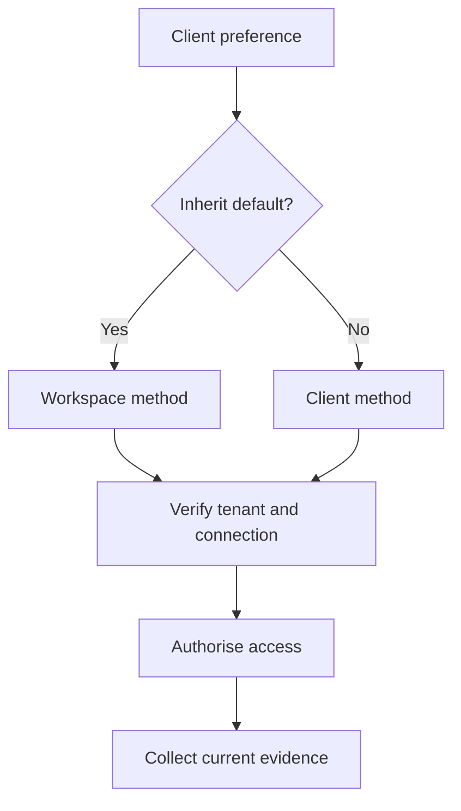

You can use **Partner Center** for most clients and **Direct** access for an exception in the same workspace. A client does not have to be in your partner customer list to use a direct connection: an administrator of that client's Microsoft tenant authorises access instead.

For example, your MSP uses Partner Center for Acme, but a newly onboarded client has no GDAP relationship with you. Keep the workspace default and select **Direct** for that client.

Review [Microsoft prerequisites and permissions](/integrations/microsoft-setup) before authorising a tenant.

Alignr's shared Direct and Partner Center routes use separate platform applications when both are configured. Choosing one route does not reuse the other route's application credentials or consent.

## Before you begin

- Create or identify the correct [Alignr client](/guides/organizations).
- Have the **Microsoft tenant ID belonging to that client**, rather than your MSP's tenant ID or its Alignr Organization ID.
- Use a role with `integration.read` to view connection settings and `integration.manage` to change them. You also need access to the client.
- For Direct, arrange for a client administrator who can approve the requested Microsoft application permissions. For Partner Center, your partner authorisation, customer consent and GDAP access must be in place.

**GDAP** is Microsoft's granular delegated admin privileges relationship between a partner and a customer. Selecting Partner Center in Alignr does not create that relationship or give your partner user additional roles. See [Microsoft’s GDAP introduction](https://learn.microsoft.com/en-us/partner-center/customers/gdap-introduction) for the underlying access model.

## Understand the default and the client choice

| Client's Connection method | Method used | What still needs configuring |
| --- | --- | --- |
| **Use workspace default** | The method saved in workspace Microsoft settings. | That client's tenant identity, connection and authorisation. |
| **Direct** | Direct access, even when the workspace default is Partner Center. | The client's direct application connection and Microsoft consent. |
| **Partner Center** | Partner access, even when the workspace default is Direct. | The partner account selected in workspace settings, this customer's assignment and access. |

The default chooses a method; it does not authorise every client. The partner account itself is selected at workspace level. There is no separate partner-account picker in the client form.

Alignr uses the selected route for Microsoft evidence. If it is incomplete, the client has a visible setup gap; Alignr does not silently switch to the other route to fill it.

## Set your usual workspace connection

Open **Settings → Microsoft**. Under **How your clients connect**, choose **Default connection method**:

<Tabs sync={false}>
  <Tab title="Usually Partner Center">
    1. Choose **Partner Center · use your partner account**.
    2. Choose an enabled live **Partner account**, or select **Add partner connection**.
    3. Select **Save Microsoft defaults**.
    4. Select **Authorise partner account** and complete Microsoft's authorisation.
    5. Return to each client's **Connections** tab to confirm its customer assignment and access.

    Use the Microsoft 365 partner-access connection for these identity checks. The separate Partner Center connection that supplies customer lists and purchased subscriptions does not itself grant this Graph access.
  </Tab>
  <Tab title="Usually Direct">
    1. Choose **Direct · authorise each client**.
    2. Select **Save Microsoft defaults**.
    3. Open each client's **Connections** tab and set up its own direct access.

    Saving the default does not share one client's authorisation with another. Each client needs its own reviewed tenant and consent.
  </Tab>
</Tabs>

**Checkpoint:** the workspace default is saved. Client setup remains a separate task.

## Connect a client outside your partner relationship

This is the **Direct (non-GDAP)** setup path for a client that is not in your Partner Center.

Use this path when the client is not in Partner Center, has no suitable GDAP relationship, or needs the supported Direct route for Intune device checks.

<Steps>
  <Step title="Open the client's Microsoft settings">
    Open **Clients**, select the client, then **Connections**. Find **How this client connects** in the Microsoft section.

    Check the client name before making changes. This is a client preference, so you do not need to change the workspace default for your other clients.
  </Step>
  <Step title="Save a Direct preference">
    Set **Connection method** to **Direct**. Enter the client's **Microsoft tenant ID** and select **Save preference**.

    **Checkpoint:** the saved summary says **Currently using Direct**. Choosing an option without saving has not changed the active route.
  </Step>
  <Step title="Prepare the direct connection">
    Under **Authorise this client directly**, leave **Use my own Microsoft application** unticked to use the Alignr application. Select **Set up direct connection**.

    Alignr prepares the client's Entra ID and Intune connections and their client mappings. Preparing those records is not Microsoft consent.

    If this client already has a direct connection, review the existing connection panel instead of creating another. For a different application or tenant, see [Replace an existing connection](#replace-an-existing-connection).
  </Step>
  <Step title="Authorise the client tenant">
    Select **Authorise Microsoft** in the direct-access panel. Complete the Microsoft authorisation with an administrator of the intended client tenant. Review the requested access on Microsoft's screen.

    Alignr uses the client's direct consent for this route; a partner GDAP relationship is not its prerequisite. Do not authorise your MSP tenant in place of the client's tenant.
  </Step>
  <Step title="Check access, then collect">
    Return to the client's connection and select **Check access**. Review the available and unavailable capabilities. For device evidence, also follow **Check Microsoft Intune access** and review that connection.

    Once the required access is available, open the relevant integration, use **Sync now** when available and inspect **Sync history**. Confirm fresh evidence belongs to the intended client before [running checks](/guides/standards).

    **Checkpoint:** the client uses Direct, its tenant is correct, and current observations come from its selected connection.
  </Step>
</Steps>

<Tip>
Setting up a direct connection saves an explicit **Direct** client preference. If you want the client to follow later workspace default changes, select **Use workspace default** and **Save preference** after reviewing what that default currently means.
</Tip>

## Connect a client through your partner account

In **Clients → select client → Connections**, choose **Use workspace default** when that default is Partner Center, or explicitly choose **Partner Center**. Confirm **Microsoft tenant ID** and select **Save preference**.

Under **Connect this Microsoft customer**:

1. Confirm that the displayed customer name and tenant ID belong to this client.
2. If an assignment is missing, use **Assign Microsoft customer** to review and link the correct customer record.
3. Select **Connect client**. This checks access and, where authorised, requests missing customer read consent. Your existing GDAP roles must allow it.
4. Review any unavailable capabilities. The access check does not create a GDAP relationship, collect evidence or run the client's controls.
5. Sync the selected connection, inspect collected observations and then run the assessment.

Managed-device checks are currently available through **Direct**. If you need that route for the client, use the direct walkthrough above rather than assuming partner access supplies Intune evidence.

## Change a preference deliberately

Changing the workspace default affects clients that inherit it. Clients explicitly set to **Direct** or **Partner Center** keep their chosen method. A client explicitly using Partner Center still depends on the partner account selected in workspace settings.

To restore inheritance, open the client's **Connections**, choose **Use workspace default** and select **Save preference**. Read the **Currently using…** summary to confirm the resolved method. If workspace setup is incomplete, the form asks you to finish it or choose a client-specific method.

After a route change, review access, collect current evidence and evaluate again. A previous result does not prove the new connection is working.

## Replace an existing connection

For an existing Direct connection, expand **Use a different Microsoft application or tenant** and select **Set up a different connection**. Then prepare and authorise the intended new connection.

Current Microsoft evidence stops contributing until the replacement is authorised and synced. Previous connections and history remain in **Integrations**. Review the tenant ID before proceeding; changing the client setting is not permission to use evidence from a different business.

If your organisation needs its own application registration, select **Use my own Microsoft application** during direct setup and provide **Application client ID** and **Application secret**. That application still needs the required Microsoft permissions and consent. Keep the secret in the connection form, never in assessment notes or support screenshots.

## If setup needs attention

| What you see | What to check |
| --- | --- |
| The client cannot inherit the default. | Finish **Settings → Microsoft**, including a usable partner account when Partner Center is selected. |
| The customer cannot be assigned through the partner account. | Confirm the customer relationship and tenant ID. Use Direct if this client should connect independently. |
| A tenant mismatch or ambiguous tenant message. | Compare the client's saved Microsoft tenant ID with its selected connection and assignments. Do not select another client just to clear the message. |
| Authorisation is required. | Complete Microsoft consent for the selected route; a saved preference alone is insufficient. |
| Some capabilities remain unavailable. | Review the reported permission, consent or GDAP gap. Check Intune through Direct when device evidence is required. |
| Access is verified but results are missing. | Collect evidence and then run controls. Access checks do neither automatically. |

You are ready to continue when you can name the client's selected method, its Microsoft tenant, the connection supplying its evidence and any capabilities still unavailable.

<Card title="Next: check collection and coverage" icon="arrow-right" href="/guides/integrations">Confirm that authorised access produces the observations your controls need.</Card>
