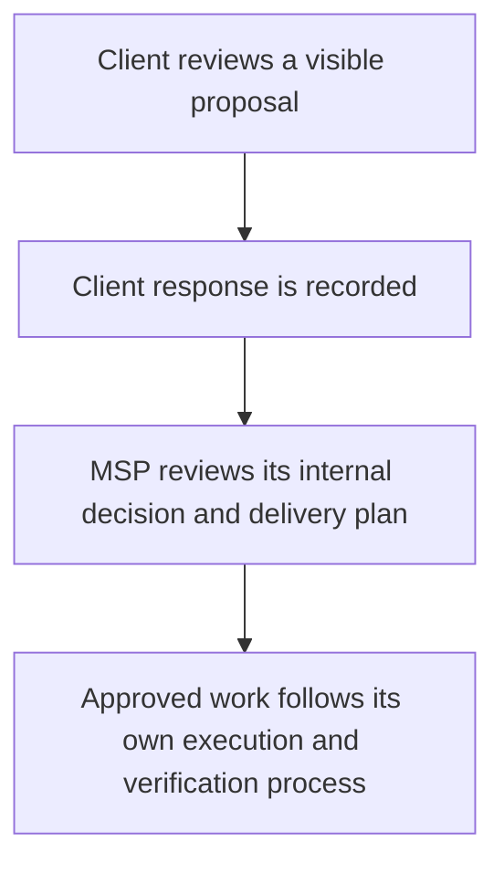

The client portal presents an audience-specific account overview. Prepare it from **Client → Client portal**. The page inside your MSP workspace is an **internal preview**; external clients sign in separately with Microsoft.

## Keep three decisions separate

| Decision | What it controls |
| --- | --- |
| Sign-in policy and person access | Who may open the client's portal. |
| Client default or person-specific view | Which sections, introduction and costs that person sees. |
| Personal decision permission | Whether that person may respond to a visible proposal. |

Assigning a view does not grant sign-in access. Granting access does not automatically permit proposal decisions.

## Prepare the MSP and client settings

<Steps>
  <Step title="Check the portal address and presentation defaults">
    Follow [workspace portal settings](/guides/settings#client-portal) to review the address, named views, section order and light/dark logos. Hosting, DNS and Microsoft sign-in prerequisites must be in place; saving an address alone does not configure them.
  </Step>
  <Step title="Choose who can sign in">
    Open the client's **Sign-in access** tab. Confirm **Microsoft tenant ID**, select **Sign-in policy**, then **Save access settings**.

    **Off — nobody can sign in** keeps the portal closed. **Only people explicitly granted access** requires individual grants. **Everyone in this Microsoft tenant** permits the tenant's people and uses the client default view unless they have an individual assignment.

    Under tenant-wide access, revoking one person's explicit grant does not stop them signing in again through that policy.
  </Step>
  <Step title="Confirm individual access prerequisites">
    For listed-contact access, an authorised administrator must have created the contact and granted portal access. A Microsoft user object ID can bind the person to their stable identity, including accounts without a verified email claim.

    The current **People & views** screen assigns views and proposal permissions; it does not provide the contact grant or Microsoft identity editor. Ask your deployment administrator or [Alignr support](mailto:support@alignr.io) to complete and verify the individual setup before sharing the portal. Do not widen the policy to everyone merely to bypass this prerequisite.
  </Step>
  <Step title="Choose the audience view">
    In **People & views**, choose **Client default view**. Under **Person assignments**, select an individual view where needed; **Use client default** inherits the client's selection. Create named views in workspace portal settings if none exist.

    If assignments changed elsewhere, reload the saved assignments, compare them with your intended change and save the reviewed choice.
  </Step>
  <Step title="Review content and proposal permission">
    Use **Content & presentation** to inspect the client narrative and presentation settings. **Scope exclusions** change the portal presentation; they do not stop internal evaluation.

    Under **People & views → Personal decision permission**, allow only the intended people to respond to proposals. A proposal must also be visible: the person's composed view needs the Roadmap section and visible costs.
  </Step>
  <Step title="Preview, then verify external access">
    Use **Overview → Preview presentation** to select the intended client layout, named view or person. Then verify an authorised person's actual external sign-in and visible client context before distributing the portal address. Inspect the logo, sections, costs and decision controls they are meant to receive.
  </Step>
</Steps>

**Checkpoint:** the correct person can sign in to the correct client and sees the intended information. A successful staff preview alone does not establish this.

## Permissions for the MSP team

Viewing the client portal requires `organization.read` and `portal.read`. Changing the client's sign-in policy requires `organization.write`. Presentation changes need `portal.write`; person assignments also need contact read access. Changing personal proposal permission requires `portal.write` and `contact.write`.

Keep contact access, portal access and proposal decisions deliberate even when one administrator manages all three.

<Accordion title="Administrator reference: individual access setup">
  The retained access-management routes include `PUT /api/v1/contacts/{contact_id}/portal-access` to grant access and `DELETE` on the same path to revoke it. Both require `portal.write` and an authenticated staff user. These contact routes are omitted from the filtered developer reference; searching that reference will not reveal them.

  Binding a Microsoft identity uses `POST /api/v1/organizations/{organization_id}/portal-contacts/{contact_id}/microsoft-identity`, requiring `portal.write` and `contact.write`. This Organization-scoped operation appears in the [live API schema](/api-reference/live-schema), which describes its request fields. Have the administrator verify the client, contact and Microsoft object identity before changing access. A contact must already exist; the current portal screen does not create it.
</Accordion>

## What your client does

Share the configured portal sign-in address with the intended person.

1. Open the provider's portal and select **Continue with Microsoft**.
2. Sign in with the account belonging to the configured client tenant. After authorisation, inspect the account overview and client identity.
3. Where available, open **Work awaiting review → Review proposal**. Read the timing, cost and recurring term before choosing **Approve** or **Decline**. Add an optional note if it helps explain the decision.
4. Confirm the proposal shows the recorded response. Use **Sign out** when finished.

The client response does not execute work or change the MSP's internal approval. Both parties should be clear about the subsequent owner and next step.

## Recover the intended experience

| Symptom | What to check |
| --- | --- |
| Sign-in page unavailable | Confirm the configured portal host and deployment with your administrator. |
| Microsoft sign-in refused | Confirm client tenant, policy, contact grant and identity binding. A staff login or evidence connection does not grant client access. |
| Wrong or missing sections | Review the person's assignment, client default, content settings and exclusions. |
| No proposals or decision button | Confirm there is a proposed item, its Roadmap/cost visibility and the person's decision permission. |
| Proposal changed or was already decided | Close the review and open the latest proposal before trying again. |
| Permission changed while reviewing | Ask the provider to review the proposal with the client. |
| Logo missing | Inspect the uploaded light/dark logos and external authenticated view. The staff preview and external image delivery use their own access contexts. |
| Sign-out reports server revocation failed | The browser session was cleared; contact the provider if immediate server-side revocation is needed. |

**You should now have:** a verified audience experience and a clear handoff for client responses. Use a [saved client report](/guides/client-reports) when the discussion needs a fixed, dated evidence snapshot.
