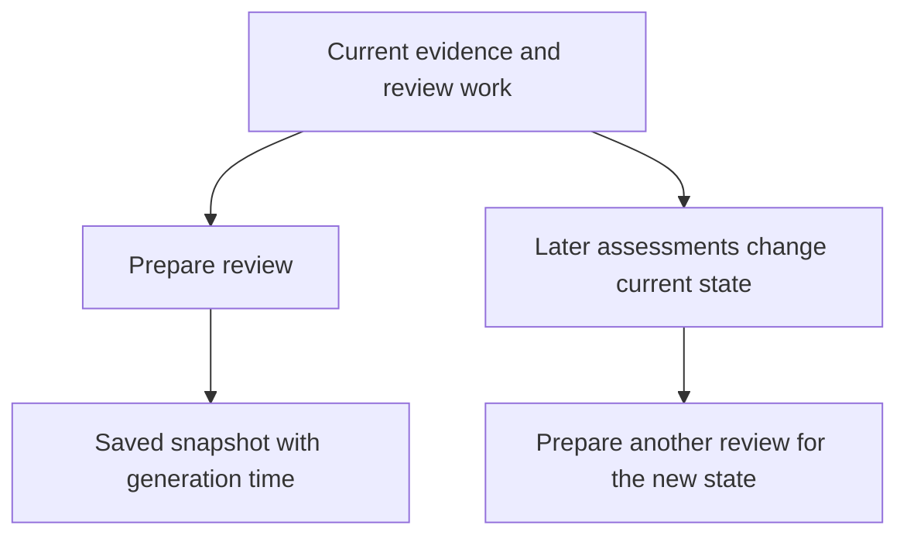

A client report preserves what was known when it was prepared: automated results, manual assessments, evidence gaps and supporting review work. Open the client and select **More → Review reports**.

Reading reports requires `dashboard.read`, `organization.read`, `detection_rule.read`, `detection.read` and `roadmap.read`. Preparing one also requires `organization.write`.

## Prepare the review

<Steps>
  <Step title="Review the current assessment">
    Confirm the client. Inspect source freshness, automated results, manual reviews and outstanding follow-up. Refresh evidence and assess again where needed before preparing the report.

    A report can honestly contain failures and gaps. It should explain them rather than make an incomplete assessment appear clean.
  </Step>
  <Step title="Save the snapshot">
    Enter a **Report name**, such as “Acme — September alignment review”, then select **Prepare review**. Open the resulting saved report and check its client, report date, generation time and author.
  </Step>
  <Step title="Read the supporting detail">
    Review the control inventory, manual assessments, risk acceptance history, open assessment work, review assignments and roadmap. Imported checklist lineage helps explain where a manual definition originated.

    Distinguish recorded outcomes from current live-score eligibility. An absent value or unassessed check must stay visible as a gap.
  </Step>
  <Step title="Export for the intended recipient">
    Select **Print or save PDF** to use your browser's print dialogue, or **Export report data (JSON)** for the saved structured report. Inspect the output, client identity and included evidence before sharing it through your approved channel.
  </Step>
</Steps>

**Checkpoint:** the saved report has an identifiable generation time, explains the evidence behind its conclusions and includes the unresolved work you intend to discuss.

## A snapshot stays a snapshot

Suppose Acme's report is prepared on 26 September with an overdue restore review. The team completes a new restore assessment on 27 September. The saved report still describes the earlier state. Prepare another report when you need a snapshot of the updated evidence.

Later work does not rewrite an earlier saved report. Select the appropriate saved review when discussing historical progress.

## Reports and the client portal

A report is a fixed review record. The [client portal](/guides/client-portal) presents the current composed view for its audience. Its presentation settings and exclusions should not be assumed to redact an exported internal report.

Inspect report contents and the recipient's authorised scope before sharing. A browser PDF export is not an automatically sent email or a scheduled reporting service.

## If the report is unavailable

| Symptom | Recovery |
| --- | --- |
| Report access denied | Ask a workspace administrator to review the required permissions. |
| Saved report fails to load | Use **Try again**. Confirm it still exists and you retain access. |
| Client name cannot refresh | Inspect the saved snapshot's client identity; do not infer that its data has refreshed. |
| Results look old | Compare generation and observation times. Refresh the underlying assessment and prepare a new report when appropriate. |
| Printed content looks wrong | Check the browser print preview, paper size and included pages before saving or sharing. |

**You should now have:** a dated, inspectable review record. Use [risk and roadmap decisions](/guides/risk-and-roadmap) to turn agreed findings into owned next steps.
