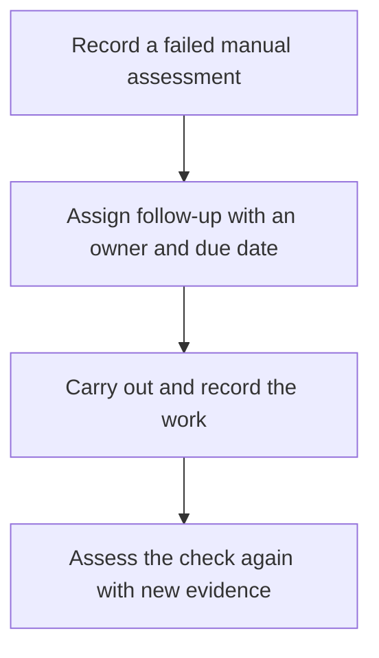

Open a client and choose **More → Manual reviews**. The **Client reviews** and **Follow-up work** tabs keep reviews separate from work after a failed check. In **Client reviews**, the page header offers **Start client review** and **Schedule one check**. Confirm the client shown above the queue; **Filters** beside the tabs can also show work across clients.

Viewing requires `organization.read` and `detection_rule.read`. Managing work requires `organization.read` and `detection_rule.write`. The check and its parent standard must be enabled before assessment.

## Choose the size of the review

| Task | Action |
| --- | --- |
| Review all manual checks currently due for one client | **Start client review**. |
| Assign one enabled check to a teammate | **Schedule one check**. |
| Track work after a recorded manual failure | Open the failed assessment's follow-up action. |

A client review takes the due manual checks at creation. Its **Review period** names the review; it does not filter the checks by calendar period. Automated controls remain outside this progress count.

## Work through a client review

<Steps>
  <Step title="Start the review">
    In **Client reviews**, select **Start client review** in the page header. Choose the client, review period, owner and due date. Inspect the number of due manual checks and add notes if useful, then confirm **Start client review**.

    If no checks are due, use **Review client checks** to inspect current results and enabled states. Do not create an artificial failure to start a review.
  </Step>
  <Step title="Record each outcome">
    Select **Start review** on a scheduled row, **Continue review** on one in progress, or **Resume review** on a paused row. The review opens beneath the list. Read the next check's instructions and perform the review. Choose **Pass**, **Fail** or **Not applicable**, enter an **Evidence note**, optionally add an **Evidence URL**, then select **Record outcome**.

    Explain what was inspected and why the conclusion follows. Keep credentials and unnecessary personal data out of notes.
  </Step>
  <Step title="Handle interruptions and changed checks">
    Use **Pause** and **Resume** when needed. If a definition changed or was disabled after the review started, inspect that change before proceeding. **Acknowledge and skip** records an explicit reason; **Skip with reason** also records a deliberate omission for a pending check.

    A skipped check has not passed. Keep the reason and any replacement review visible.
  </Step>
  <Step title="Complete the review">
    Inspect the recorded outcomes and skips. **Complete review** becomes available when no items remain pending. Completed reviews cannot be resumed; create a new review when further work is due.
  </Step>
</Steps>

**Checkpoint:** every included item has a recorded outcome or explicit handling decision, with evidence and unresolved work visible. “Checks handled” measures review progress, not the percentage passing or the automated alignment score.

Review rows show **Scheduled**, **In progress**, **Paused**, **Completed** or **Cancelled** with a handled count. Inside a review, each check is marked **To review**, **Recorded** or **Skipped**. These labels describe the review work; read the recorded outcome and evidence to understand the result.

## Schedule one check

Use **Schedule one check** for a particular enabled manual check. Choose its client, check, owner and due date. Use queue filters to find an owner's work, overdue work or unassessed assignments. Review assignments retain their linked assessment outcome; a work status is not a substitute for recording evidence.

## Follow a failed assessment

Work completion and a new assessment are separate steps. The original failure remains in history.

For example, Acme's restore review fails because the restored application cannot open its data. In the completed review item, select **Open follow-up work**. Choose an owner, due date and notes, then **Create follow-up**. The task stays linked to that failed assessment.

After the recovery issue is addressed, record another manual assessment with the new restore evidence. Marking the task completed alone does not turn the old failure into a pass. If an open follow-up already exists for that assessment, use it rather than creating a duplicate.

## Recover a blocked review

| What you see | What to check |
| --- | --- |
| No matching work | Confirm the client scope, owner and date/status filters; use **Clear filters**. |
| No due or enabled checks | Inspect the client's manual checks, their cadence and parent standard's enabled state. |
| Changed or disabled item | Read the current definition and make an explicit handling decision; do not infer its outcome. |
| Outcome could not be recorded | Review the error and retained draft. Confirm current check state before retrying. |
| Review cannot complete | Find remaining pending items; failed outcomes can be recorded while follow-up stays open. |

**You should now have:** a review trail and owned follow-up for unresolved findings. Next, [prepare a client report](/guides/client-reports) that preserves the evidence and remaining work.
