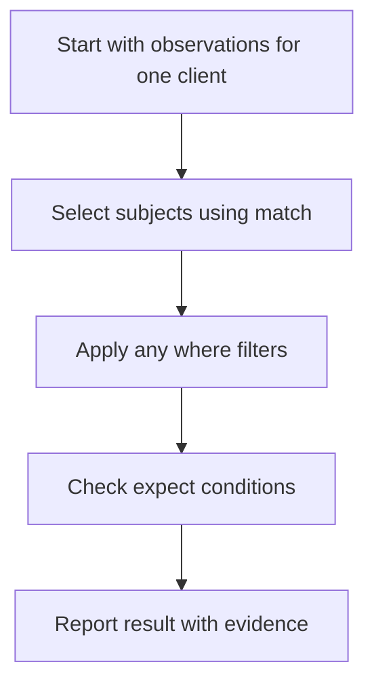

A control asks: **“For these subjects, does this expectation hold?”** Start with that sentence before choosing predicates.

For example: **“For observed Global Administrators, MFA must be registered.”** This is a registration check. It does not prove that a sign-in policy always requires MFA.

## The parts of a control

| Part | Question it answers | Example |
| --- | --- | --- |
| Population / `match` | Who or what should we look at? | Subjects with `has_role = Global Administrator`. |
| Filters / `where` | Which of those subjects remain in scope? | Optionally, only those with an observed enabled account. |
| Expectation / `expect` | What must be true for the selected subjects? | `mfa_registered` equals `true`. |
| Evidence | Which observations help explain the result? | Role membership and MFA registration. |
| Parameters | Which values can be configured? | A check-in age limit in days. |



Each step narrows or evaluates the same client's evidence. The source coverage and freshness checks described in the [status guide](/guides/control-status) also apply.

## Use the editor labels

For a step-by-step example in the app, follow [Create a custom control](/controls/create-custom). These labels connect the editor to the concepts above.

In the control editor:

- **Population predicate** identifies the observation used to find subjects.
- **Fact to verify** identifies the observation you want to check.
- **Operator** chooses the comparison.
- **Value source** selects a literal value or a parameter.
- **Expected value** supplies the value that should satisfy the comparison.

The simple creation form selects a population predicate; it does not expose every advanced `match.object` or `where` combination shown in JSON examples. Do not assume selecting `has_role` alone means only Global Administrators. Review the saved definition or use the suitable built-in control when you need a particular population.

## Worked example: administrator MFA

Read it as: **“Find subjects observed holding the Global Administrator role. Check that each has an observed MFA registration value of true. Cite the role and registration observations.”**

The definition below uses the same shape as the built-in administrator MFA control. It is a definition example, not a complete API request body.

<Accordion title="View the control definition">

```json
{
  "match": {
    "predicate": "has_role",
    "object": "Global Administrator"
  },
  "expect": [
    { "fact": "mfa_registered", "op": "eq", "value": true }
  ],
  "severity": "high",
  "title": "Global Administrator lacks MFA",
  "evidence": ["has_role", "mfa_registered"]
}
```

</Accordion>

For a simplified evaluation with suitable source coverage and fresh evidence:

| Observed administrator | MFA evidence | Meaning |
| --- | --- | --- |
| Alex | `true` | The expectation is satisfied for Alex. |
| Morgan | `false` | There is evidence of failure for Morgan. |
| Sam | No observation | Sam's registration is unknown. |

This population produces a **fail** because Morgan's observed value proves the expectation is not met. Sam's unknown result must still be investigated; the failure does not make their evidence complete.

If Alex were the only observed administrator, this example could pass. If Alex and Sam were the population, it would be `no_data`, because Sam's missing observation prevents a complete pass. An empty observed population is also `no_data`, not an automatic exemption.

## Operators in plain English

| Operator | Meaning | Typical use |
| --- | --- | --- |
| `eq` | Equals the expected value. | MFA registration equals `true`. |
| `neq` | Does not equal the expected value. | A reported state differs from an excluded state. |
| `gt` / `gte` | Greater than / greater than or equal to. | A reported count exceeds a threshold. |
| `lt` / `lte` | Less than / less than or equal to. | Pending patches are at most an agreed number. |
| `in` / `not_in` | Is / is not one of an expected list of values. | An observed platform is one of the supported platform names. |
| `exists` | The observed value is not null. | An observed property has a usable value. |
| `not_exists` | The observed value is null. | An observed null value; not a shortcut for absent evidence. |
| `contains` | The observed value contains the expected member or text. | A substring or structured collection member. |
| `matches` | The observed text matches a regular expression. | A naming convention. |
| `older_than_days` | The observed timestamp is more than the supplied number of days in the past. | Last activity exceeds a permitted age. |
| `within_days` | The timestamp is within the supplied number of days of now, in the past **or future**. | A recent event or approaching expiry, depending on the predicate. |

<Warning>`within_days` works on either side of the current time. It is not a dedicated “expires in the future” operator. Choose and verify the predicate and intended comparison carefully.</Warning>

## Missing data and sets need care

In control evaluation, a missing observation is unknown even for `neq`, `not_in`, `exists` and `not_exists`. A negative comparison must not turn missing evidence into a pass.

The population condition (`match`) can select a particular value among a subject's observations. Conditions in `where` and `expect` compare the latest fact for the named predicate; they are not general “every set member” expressions. For set-valued predicates, verify that the rule expresses the intended question.

General account checks exclude a Microsoft identity only when the selected source has a current observation identifying it as a Guest. Missing or stale `user_type` evidence is unknown and prevents a complete passing assessment for that subject; it is not evidence that the account is a Member or Guest. Service and non-mailbox Member accounts remain eligible. To check guests specifically, select the observed value `Guest` in `match` or `where`. A control title, evidence list or email/UPN pattern does not select that population. See [advanced definitions](/controls/advanced-definitions) for an example.

Multiple filters are combined with **AND**, as are multiple expectations. A known-false filter excludes a subject; an unknown filter can prevent a complete pass. A known-false expectation proves failure.

## Parameters and client overrides

A parameter gives a threshold a stable name. In a definition, `{"param": "max_age_days"}` refers to an effective parameter value rather than a hard-coded number. Declare the parameter and its type, set the standard default, then review any client override.

For example, a 7-day reporting limit and a client-specific 3-day limit are two different expectations. The result must be read against the client's effective limit. The exact boundary matters: `older_than_days` means strictly older than the limit.

## Before enabling a control

1. Write the expectation in one plain-English sentence.
2. Confirm the population is the one you intended.
3. Check the [predicate reference](/guides/predicate-reference) and real observed values.
4. Confirm the client has the required source coverage and usable evidence.
5. Review a satisfying example, a failing example and a missing-evidence example.
6. Check parameters and client overrides, then inspect the saved result and citations.
