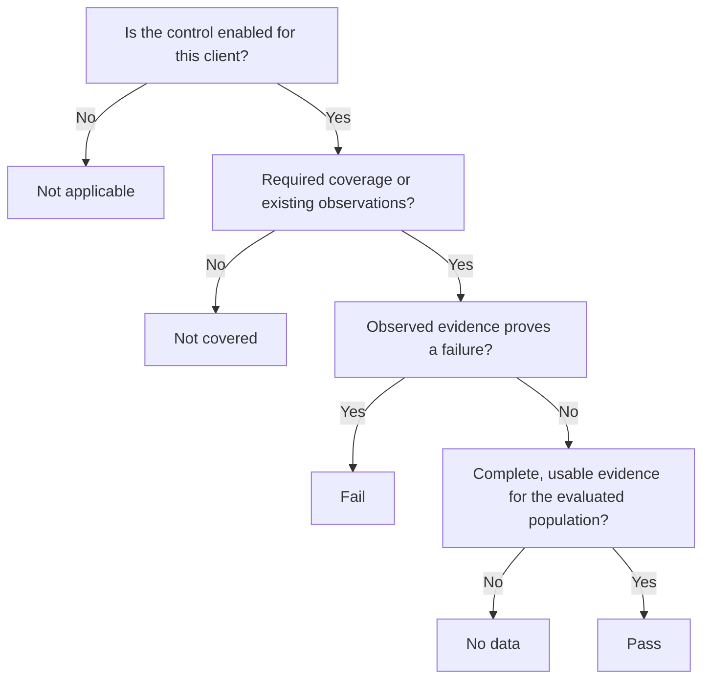

A control result answers a specific question using available evidence and the client's effective settings. Read the status together with its reason, scope, parameters and evaluation time.

## The five statuses

| Status | In plain English | What to do next |
| --- | --- | --- |
| `pass` | The evaluated expectation is satisfied by usable evidence. | Confirm the population, freshness and effective parameters. |
| `fail` | Observed evidence shows that the expectation is not met. | Inspect the failing subjects and their citations. |
| `no_data` | There is not enough usable evidence to establish a complete pass. | Investigate missing observations, empty populations or freshness. |
| `not_covered` | A required observation has neither source coverage nor existing evidence that can reconcile the coverage gap. | Review missing predicates and the sources that can supply them. |
| `not_applicable` | The effective configuration excludes or disables the control for this client. | Confirm that the exemption is intentional. |

## How to read the decision

This is a simplified reading aid; the result's detailed explanation is authoritative for the individual evaluation.

Coverage describes whether the control can obtain the observations it needs. Completeness describes whether it has enough suitable observations to reach a result. An existing observation can be evaluated despite degraded live source coverage, subject to freshness checks.

## One control, several possible outcomes

Consider **“Observed Global Administrators must have MFA registered.”** Assume that the control is enabled and the source covers the required predicates unless the row says otherwise.

| Situation | Expected interpretation |
| --- | --- |
| Every selected administrator has a fresh `mfa_registered = true` observation. | `pass` for this registration expectation. |
| One selected administrator has `mfa_registered = false`. | `fail`, citing that observed failure. |
| No failures are observed, but one selected administrator has no MFA observation. | `no_data`; unknown must not become passing. |
| No selected administrators are observed. | `no_data`; an empty observed population is not an exemption. |
| No suitable source or existing observation supplies a required predicate. | `not_covered`. |
| The effective configuration disables the control for this client. | `not_applicable`. |

## Failure and incomplete evidence can coexist

A known failure is still a failure when another subject is unknown. If Morgan has an observed MFA registration value of false and Sam has no observation, the control can fail because of Morgan. That result does not claim Sam was successfully assessed.

Likewise, a source outage does not automatically clear an existing issue. Review both the finding and the collection problem.

## Do not turn gaps into a healthy score

A client with ten passing controls and ten unknown controls has not demonstrated that all twenty expectations are met. Review alignment and evidence coverage together. Exclusions, missing data and unsupported checks must remain visible when explaining the assessment to a client.

## Investigate in this order

1. Confirm the Organization and control.
2. Read the detailed reason, not only the badge.
3. Check effective parameters and any override or disabled state.
4. Inspect the selected population and failing subjects.
5. Check the cited evidence, its source and its timestamps.
6. Resolve a coverage, collection or configuration problem before reassessing.

For an assistant-based explanation, `explain_control_status` accepts an Organization ID and control identifier. See the [MCP tools](/mcp/tools) for its required scope.

## Continue

[Investigate an unexpected result](/guides/troubleshooting) or [choose a baseline](/controls/baselines/overview) for another assessment.
