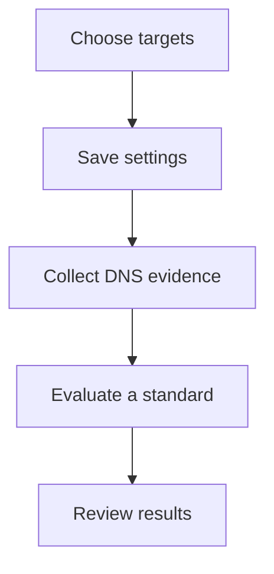

Alignr's built-in domain checks collect public DNS observations for SPF, DMARC, mail delivery records (MX) and nameservers. Use them to assess specific domain expectations. They do not scan ports or establish that every aspect of email security is configured correctly.

Open **Clients → select client → Domains**. Viewing requires integration-read access; changing settings or running a check requires integration-management access, alongside access to the client.

## Choose the domains

<Steps>
  <Step title="Review discovered domains">
    Under **Discovered domains**, review verified custom domains reported by the client's selected Microsoft connection. Untick any domain you want to leave out.

    If discovery is unavailable, follow **Review connection**. A saved connection may still need authorisation and a successful sync before domain observations are available.
  </Step>
  <Step title="Add other client-owned domains">
    Under **Manual domains**, enter one client-owned domain per line. You can use manual targets even when Microsoft discovery is unavailable.

    For example, a fictional Acme client might have its Microsoft-discovered domain and a separately managed marketing domain. Review both ownership and intended scope before including them.
  </Step>
  <Step title="Save the intended scope">
    Set **Run domain checks** as intended, then select **Save settings**. While the save is in progress, the inputs are disabled and the button shows **Saving…**. Confirm the saved state before running a check.

    Checks support up to 50 selected domains. If more are discovered, exclude unwanted domains and reduce the manual list before enabling and saving. The target set combines discovered and manual domains, then removes exclusions.
  </Step>
  <Step title="Collect and evaluate">
    Select **Check now**. The button requires saved, enabled settings, at least one domain and no unsaved edits. Wait for **Domain check completed** and review **Last check** and any source error.

    Collection produces evidence ready for evaluation. Run the appropriate standard to obtain updated control results, then inspect their source and observation time.
  </Step>
</Steps>

## Understand automatic checks

| State | What it means for this client |
| --- | --- |
| Enabled, saved and scheduler healthy | Selected domains can be checked automatically. You can also use **Check now**. |
| Automatic checks paused | Save the settings and use **Check now** for immediate collection. Review [Workspace health](/guides/workspace-health) for the scheduling condition. |
| Scheduler unavailable or recovering | Do not assume a scheduled collection happened. Inspect health and use **Check now** where available. |
| Checks disabled and saved | Automatic collection is paused for this source; your domain choices are retained for later use. Disabling collection is not a passing assessment. |

Saving a removed target or disabling checks withdraws this source’s current observations for those targets immediately; observations with another remaining source can survive. Retained domain choices are not retained evidence. Review the client’s coverage after changing scope, even before another DNS check runs.

## Keep the milestones separate

Choosing a domain does not query DNS. A completed DNS check supplies observations; evaluating a standard compares them with your expectations. A missing or failed lookup must not be turned into a pass.

## Investigate a problem

| Symptom | Next action |
| --- | --- |
| Microsoft domains are missing. | Check the selected client connection and its latest successful sync. Manual targets are available when discovery cannot supply them. |
| An excluded domain still needs checking. | Re-select it under **Discovered domains**, save, then collect again. |
| **Check now** is unavailable. | Confirm permissions, enabled saved settings, at least one target and no unsaved edits or active save/check. |
| The 50-domain limit prevents saving. | Reduce the selected target set. Adding the same domain manually does not override its exclusion. |
| **Last check could not complete** is shown. | Read the source error, confirm domain spelling and collection status, then retry after resolving the cause. |
| DNS evidence is current but a result is old. | Run the relevant standard and inspect its evaluation time. |

**Checkpoint:** you can name the domains being checked, explain how they were selected, and distinguish collection time from assessment time.

Continue with the [email and domain baseline](/controls/baselines/email) for the observations, automated expectations and separate manual reviews.
