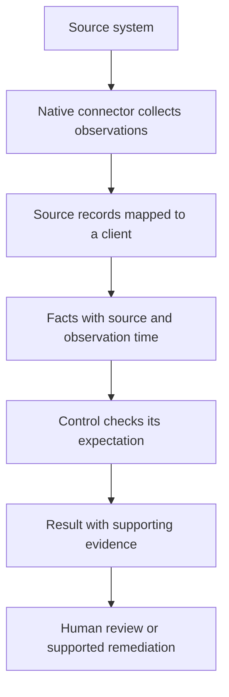
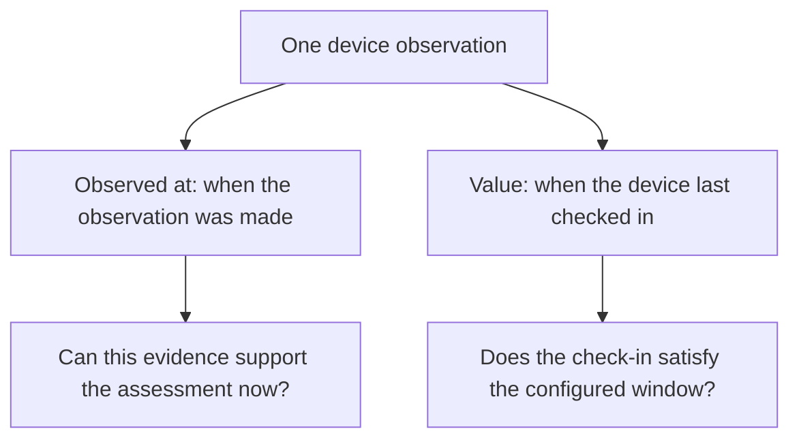

A **fact** records something observed. **Evidence** is the set of facts supporting a particular result or claim. The difference is the job the observation is doing: an observation becomes supporting evidence when you use it to explain a conclusion.

## From a source to a result

A working connection is only the first part of this process. The observations must belong to the correct client, answer the control's question and be suitable for evaluation.

## Read an evidence record

The client's **Evidence** tab shows current normalised observations in a compact table with **Subject**, **Observation**, **Value**, **Source** and **Observed** columns. Search or filter by subject, predicate and source; open the row’s options menu and choose **View JSON value** to inspect its value. Select a sortable column heading to cycle ascending, descending and back to its default order. Sorting applies to all rows matching the current client and filters before pagination; by default, newest observations appear first. Values are ordered by their safe displayed projection, so withheld or structured values are never sorted using their raw contents. This is an observation view, not a pass/fail summary. The tab's current facts do not replace the assessment's cited evidence or freshness checks.

The following is an illustrative explanation, not an API response:

| Field | Example | Why it matters |
| --- | --- | --- |
| Organization | Acme | Identifies whose environment this describes. |
| Subject | `alex@example.com` | Identifies the person, device or other thing observed. |
| Predicate | `mfa_registered` | Names the property being observed. |
| Value | `true` | Records what the source reported. |
| Source system | Identity provider | Tells you who made the observation. |
| Source reference | The source's user identifier | Helps trace it to the original record. |
| Observed at | A UTC timestamp | Tells you when the observation was made. |
| Confidence | A recorded confidence value | Describes confidence in the observation; not a compliance score. |

See [Understanding predicates](/guides/predicates) for how to turn technical field names into readable statements.

## Observation time versus event time

These answer different questions. A connector may collect evidence today that a device **last checked in three weeks ago**. The observation is fresh; the device's check-in is old.

Conversely, an old observation saying a device checked in recently at the time of collection does not prove the device is still reporting today. Inspect both the observation timestamp and any timestamp stored in the value.

### Two clocks in one record

Consider these fictional device observations at **26 September, 12:00 UTC**:

| Observation collected | Reported last check-in | What you can conclude |
| --- | --- | --- |
| 26 September, 11:55 | 5 September, 09:00 | The source recently reported an old check-in. Fresh collection does not make the device's check-in recent. |
| 5 September, 09:05 | 5 September, 09:00 | The record described a recent check-in when collected, but it cannot establish today's reporting state. |

Inspect both clocks. Source collection refreshes what Alignr knows; it does not change when the device last reported. This distinction also applies to backup success, sign-in and expiry timestamps.

## Freshness and source health

A source error does not erase every observation it previously supplied. Existing suitable evidence can still explain a result, with degraded source coverage reported separately. Once evidence is too old to support a pass, it must not continue presenting a clean assessment.

Check the control's detailed reason and source state rather than assuming that all facts have one universal freshness period. A historical failing observation may remain useful evidence of a problem even where stale evidence can no longer establish a pass.

## Disagreement and multiple values

Two sources can report different values for the same property. Investigate source identity, timing and meaning before accepting a convenient answer. One source saying an agent is installed and another saying it last checked in yesterday are different properties, not a conflict.

Some predicates legitimately have several values: a user can hold multiple roles and a device can be protected by multiple products. See the “Multiple values” notes in the [reference](/guides/predicate-reference).

## Missing evidence checklist

<Steps>
  <Step title="Check the client">Confirm the selected Organization and the source mapping. Similar names do not prove identity.</Step>
  <Step title="Check the source">Confirm credentials, collection state and the scope of the connected source.</Step>
  <Step title="Check the property">Confirm that the connector actually produces the required predicate. A related property is not equivalent.</Step>
  <Step title="Check timing">Inspect observation time and relevant event timestamps. A successful old collection is not proof of current posture.</Step>
  <Step title="Reassess">After resolving the cause, collect and evaluate again. Confirm the result is backed by the intended evidence.</Step>
</Steps>

## Using evidence in an assistant answer

Agent claims require citations. Open the cited evidence, confirm the client and subject, and check whether the observation supports the exact claim being made. A fluent answer without usable evidence is not a reason to change a client's environment.

## Continue

[Interpret the control result](/guides/control-status) or [troubleshoot missing evidence](/guides/troubleshooting).
