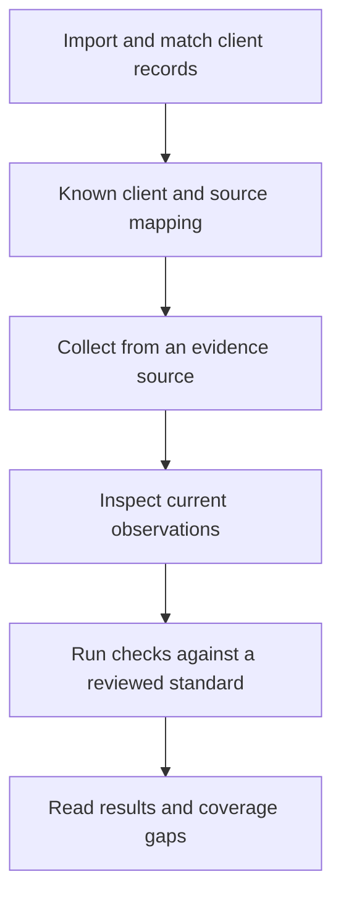

## Choose the job before connecting

A connection can supply client records, assessment evidence, or both depending on its supported capabilities. Check the selected integration's description and connection mode.

| Your task | Look for | Next action |
| --- | --- | --- |
| Bring source companies or tenants into Alignr. | A client-directory source or a source that supports client discovery. | Import and explicitly match client records. |
| Assess account, device or workload settings. | An evidence source that supplies the control's required observations. | Map the source, collect evidence and run checks. |
| Explore a demonstration. | A connection marked simulated/demo. | Treat it as demonstration data; use a live source for client evidence. |

A **client-directory source** does not write evidence facts or execute remediation. Importing a client from it is useful setup work, but it does not supply MFA, patching or backup observations.

## Connect and follow the appropriate path

Open **Integrations** and select your source. Follow the connector's connection form with an account permitted to grant the requested access. Use the connection mode and credentials described by that form.

<Tabs sync={false}>
  <Tab title="Import client records">
    1. Open **Clients → Import clients**, or use **Import clients** on a directory integration.
    2. Select the **Import source** and use **Refresh client records** when available.
    3. Review stable identifiers and choose the correct existing client before selecting **Link**, or use **Create** for a genuinely new client.

    **Checkpoint:** the intended source record is linked to the right Organization. Follow [Organization mapping](/guides/organizations) for the identity checks.
  </Tab>
  <Tab title="Collect assessment evidence">
    1. Review the integration's **Clients & sites** mappings for the intended client.
    2. On an evidence integration where it is available, use **Sync now**. Inspect **Sync history** for the collection outcome.
    3. Confirm the required observations arrived with the intended client, source and observation time.
    4. Review and enable the standard, then use **Standards → Run checks**.

    **Checkpoint:** a completed evaluation uses the intended evidence. A source can connect successfully while a particular observation remains unavailable.
  </Tab>
</Tabs>

## Import, collect and assess are different actions

The diagram is a workflow, not a chain of automatic triggers. A directory refresh does not collect control evidence, and **Run checks** does not start a source sync or retry. Confirm each completed step before moving on.

## If a step does not complete

- **Authorisation fails:** check connection mode, credential expiry and vendor permissions.
- **Client missing:** check the import source, its access and unresolved client matches.
- **Evidence missing:** confirm this is an evidence source, collection completed, and the source supplies the required predicate.
- **Evidence stale:** inspect collection failures and credential validity, then confirm new observations arrive.

[Follow the troubleshooting path](/guides/troubleshooting#connected-but-no-results) for the symptom you see.

## Why one source cannot answer every question

An RMM may report device check-ins and pending patches. An identity source may report roles and MFA registration. Those sources describe different subjects and properties. A source's product category is not enough to promise a particular observation: check the exact [predicate](/guides/predicates) and the client's coverage explanation.

Some sources deliberately withhold a field when they cannot supply it reliably. Connecting more integrations does not automatically fill every gap.

## Reconnect without assuming recovery

After renewing credentials or fixing access, check that collection actually resumes, that the client mapping remains correct and that the relevant evidence has a new observation time. Then inspect a fresh evaluation. A successful credential save alone is not proof that assessments have recovered.

## Microsoft partner access and staff invitations

In workspace setup, prepare a dedicated account in your MSP’s own Microsoft partner tenant and keep MFA enabled. Use Microsoft’s authorisation screen; do not enter the account’s password into an Alignr form. Choose **Partner Center** as your workspace default and select the partner connection.

The partner authorisation also requests delegated Graph `User.Read` and `User.Read.All` for the optional staff-directory preview. An existing connection may need to be authorised again to grant these permissions. Customer GDAP access does not substitute for consent to read your MSP’s own directory.

Alignr prepares key protection for each MSP workspace automatically. You can create an account and work on other setup steps while it is pending, but new connection credentials and Microsoft authorisation wait until that protection is verified. If the connection step says setup needs attention, a workspace administrator can select **Retry setup** there.

After connecting and selecting the partner connection as the workspace Microsoft default, open **Invite your teammates** and choose **Preview my directory**. Review each selected person’s email and Alignr role before submitting the invitation. Existing workspace users, guests and disabled accounts cannot be invited through this preview. A preview may be limited; it explicitly reports when it does not contain the whole directory.

The preview reads your partner tenant only; it does not read customer directories or create Alignr users. An administrator needs both `integration.manage` and `user.manage` to run it. For an API client, call `POST /api/v1/integrations/{integration_id}/microsoft-directory-users` with an authenticated user who has both permissions. The response contains `tenantId`, `truncated`, and `users`; each user includes an identifier, display name, email when available, user principal name, account status, user type, `eligibleForInvite`, and `alreadyInWorkspace`. A preview stops after a bounded number of users, so use the `truncated` flag before treating it as a complete directory list. Invitations still require separate review and submission in Alignr.

Staff invitations use your MSP’s own tenant. Customer organisations are imported through the separate client import and matching workflow. Importing staff does not enable Microsoft single sign-on or copy Microsoft administrator roles into Alignr.

For invitation delivery and access checks after selecting a person, follow [Your account and team](/guides/account-and-team).

After returning from Microsoft authorisation, use **Return to setup** to continue the wizard.

## Continue

[Map the source to your clients](/guides/organizations), then [choose a standard](/guides/standards).
