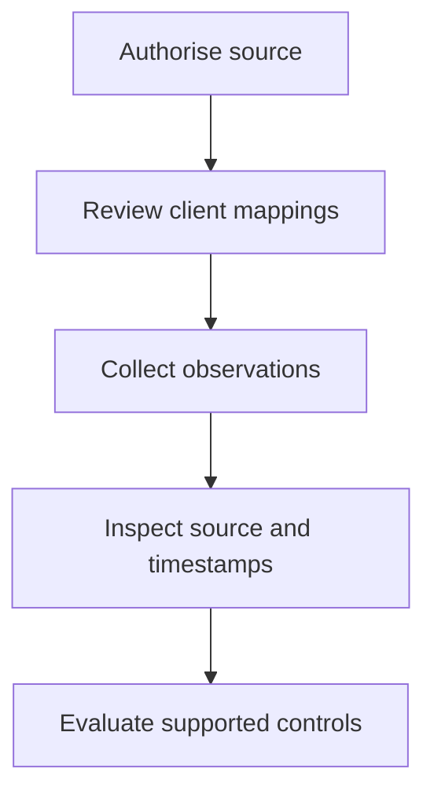

## Connect your source

Open **Integrations** and select the source you want to connect. The connection form identifies the credentials and settings for that connector. Follow the vendor’s authorisation process with an account permitted to grant the requested access.

Use the least access required by the selected connection mode. Do not reuse a personal administrator password where the connector supports a dedicated application or API credential.

## Map source records

After connecting, review discovered companies or tenants and explicitly link them to your clients. A source record with a similar name is not proof that it belongs to the same Organization.

[Review Organization mapping](/guides/organizations).

## Check collection

Inspect the connection’s collection status and the evidence it produces. Check the correct client, source reference and observation time. A source may connect successfully but return no usable evidence for a particular control.

## Troubleshoot

- **Authorisation fails:** check the connection mode, credential expiry and vendor permissions.
- **Client missing:** check source access and unresolved mappings.
- **Evidence missing:** confirm collection completed and the connector supplies the predicates the control requires.
- **Evidence stale:** check recent collection failures and credential validity.

[Understand evidence and coverage](/guides/evidence).

## Connection, mapping, collection and coverage

These are four separate milestones:

| Milestone | What it establishes | What it does not establish |
| --- | --- | --- |
| Connected | Alignr can use the configured source connection. | Every client or source feature is accessible. |
| Mapped | A source record is linked to the intended client. | Collection has produced all required observations. |
| Collected | A collection run produced or refreshed evidence. | Every predicate needed by every control is present. |
| Covered | The control's evidence requirements are supported in the client's context. | The available observations satisfy the control. |

## Why one source cannot answer every question

An RMM may report device check-ins and pending patches. An identity source may report roles and MFA registration. Those sources describe different subjects and properties. A source's product category is not enough to promise a particular observation: check the exact [predicate](/guides/predicates) and the client's coverage explanation.

Some sources deliberately withhold a field when they cannot supply it reliably. Connecting more integrations does not automatically fill every gap.

## Reconnect without assuming recovery

After renewing credentials or fixing access, check that collection actually resumes, that the client mapping remains correct and that the relevant evidence has a new observation time. Then inspect a fresh evaluation. A successful credential save alone is not proof that assessments have recovered.

## Continue

[Map the source to your clients](/guides/organizations), then [choose a standard](/guides/standards).
