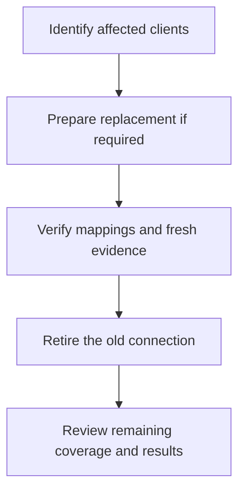

A connection needs ongoing care when credentials expire, endpoints change or clients move between tools. Start by identifying the named connection and the clients mapped to it. These actions require integration-management permission.

## Rotate credentials

<Steps>
  <Step title="Prepare the replacement bundle">
    Obtain the replacement credentials for the same intended vendor account. Check its region, endpoint and scope before changing Alignr. Review the [product setup guide](/guides/integration-catalogue) for fields that depend on the connection mode.
  </Step>
  <Step title="Edit the named connection">
    Open **Integrations → select connection → Edit**. Stored secrets are not displayed. Leaving the credential fields blank keeps the current bundle.

    Once you change a credential or destination, enter **every required field** needed to replace the bundle. Do not enter only a new secret and assume the old fields will be combined with it.
  </Step>
  <Step title="Save and verify access">
    Select **Save changes** and read the outcome. Use **Test connection** where offered. For Microsoft, complete the relevant **Authorise Microsoft**, **Reconnect** or **Check access** workflow.

    **Checkpoint:** the saved configuration can access the intended account. If saving fails, read the error and inspect the saved configuration before assuming the replacement took effect.
  </Step>
  <Step title="Verify collection recovery">
    Review **Client mapping** so the source still maps to the intended clients. For evidence sources, use **Collect now**, inspect **Collection history** and confirm relevant observations have a fresh time. Then run the affected checks again.

    For directory-only sources, use **Import clients** and **Refresh client records**; these sources do not collect control evidence.
  </Step>
</Steps>

Revoke an old credential according to your vendor's rotation process once the replacement has been verified. If the old credential is compromised, follow your incident process instead of waiting for a routine rotation window.

## Change a destination or account

An endpoint edit can point the same connection at a different account or appliance. Treat it as an identity change: review credentials and all affected mappings together. A similar site name in the new account is not proof it is the same client.

For a replacement Microsoft application or tenant, use [the client Microsoft replacement workflow](/guides/client-microsoft-connections#replace-an-existing-connection). It retains history while requiring the replacement to be authorised and synced.

For another vendor, a separately named new connection can make the replacement easier to inspect. Link the intended source records deliberately, collect evidence, and review the old source's continued contribution before retiring it. Do not assume that adding a second source automatically establishes priority between contradictory observations.

## Review the collection interval

The connection editor exposes **Sync interval** for evidence sources. Change it to the appropriate offered interval and save. Directory-only sources use explicit directory refresh rather than an evidence schedule.

A saved interval is not proof that the scheduler is running. Check [Workspace health](/guides/workspace-health), recent collection history and observation times. If scheduled collection is paused, investigate the reported cause; repeatedly saving the interval does not repair scheduler health.

## Delete a connection deliberately

Open the connection and select **Delete**, review the confirmation, then **Delete integration** when you intend to retire it.

| Connection type | What deletion does | What it preserves |
| --- | --- | --- |
| Evidence source | Prevents future scheduled collection for the deleted connection and removes its remote-company mappings. | Previously written facts remain; deletion does not itself retract them or immediately remove their contribution to results. |
| Client-directory source | Stops directory refresh and removes its remote-company mappings. | Existing Alignr clients remain. |

Retained facts are not a promise of continuing coverage. Revisit affected client results and source health after deletion; historical observations must not be mistaken for fresh evidence from a working connection.

The diagram describes a planned replacement. Deletion is a separate explicit action, not an automatic result of adding a new connection.

## Inspect a collection attempt

Open **Integrations → select connection → Collection history**. The table shows each attempt's start time, result, records read, facts written and duration. Select the row or **View details** to inspect it.

For a failed attempt, read the full explanation first. Where recorded, **Attempt details** includes the HTTP status, request method and request category. **Response body** shows the saved diagnostic fields, with sensitive values omitted. This can distinguish missing Microsoft consent from a different failure that also returns HTTP 400.

**Records read** counts source records processed during the attempt. **Facts written** counts evidence saved. An attempt can read records and still fail before saving evidence. A populated client directory therefore does not prove that evidence collection succeeded.

Microsoft Partner Graph collects each selected customer independently. If one customer's Graph access fails while another succeeds, collection can finish **partially**: fresh facts for successful customers are published, but the failed customer's existing Partner Graph observations do not count as current evidence or coverage. The shared collection cursor stays unchanged, allowing the next attempt to retry the missed customer without treating its old observations as fresh. If all selected customers fail, the attempt fails. Fix the affected customer's access, then select **Collect now** and review the new attempt. This collection recovery does not grant consent or change GDAP roles; use the client Microsoft guide's explicit access and consent steps where needed.

Older attempts may have no response details. Their original response cannot be recovered from this view. After addressing the reported problem, use **Collect now** and inspect the new attempt. **Refresh** updates history; it does not start a collection.

## Refresh across clients

**Refresh evidence** on Overview collects from eligible connections and checks each standard within its saved client scope. A selected-client standard only runs for its assigned active clients. If a client or mapping changes, Alignr reports the affected check separately while continuing unrelated collection and checks.

## If a refresh loses its response

When you return to **Overview**, Alignr checks an unanswered refresh once using the original request. While it checks, the page shows **Checking your previous refresh**. If the result is still unavailable, use **Check refresh** to try again. This checks the same request so it does not start a duplicate collection.

## A useful recovery record

Record the connection name, vendor region or account identifier, affected clients, last successful collection time, visible error and the result of your last check. Keep API keys, secrets and full credential responses out of the record.

**Finish when:** you can trace current client evidence to the intended active source, explain any remaining coverage gaps and distinguish retained history from new observations.
