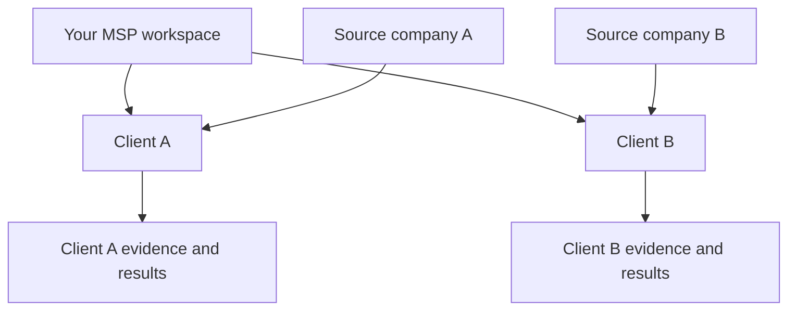

## Your workspace and your clients

Your **tenant** is your MSP’s workspace. An **Organization** is one of your clients within that workspace. The application also uses **Clients** for the client-facing workflow; API paths use `organizations`.

## Link a source record

Review the companies or tenants discovered by a connected source. Choose an existing client or explicitly create one. Confirm the source identifier as well as the name before linking.

Mapping establishes where evidence belongs. Incorrect mapping can produce misleading assessment results even when a connection is healthy.

## Use an Organization ID

The [API quickstart](/api-reference/introduction) lists the Organizations visible to your key. Use the returned `id` when an API operation or MCP tool asks for `organization_id`.

A key does not gain access to another MSP’s data by supplying its identifiers.

## Example: one MSP, two clients

The diagram shows explicit source-to-client mapping. Your workspace can contain multiple clients, but a source record must be attached to the correct one before its evidence can support that client's assessment.

## Names are not identifiers

“Example Ltd” may exist in more than one source, with different spelling or ownership. Review stable source identifiers and the expected environment as well as display names. In API and MCP requests, use the returned Organization ID rather than substituting its name.

## Before reviewing a client

Confirm the selected client, mapped source records, applied standards and effective overrides. If evidence appears in an unexpected assessment, investigate the mapping and subject identity before changing the control.
