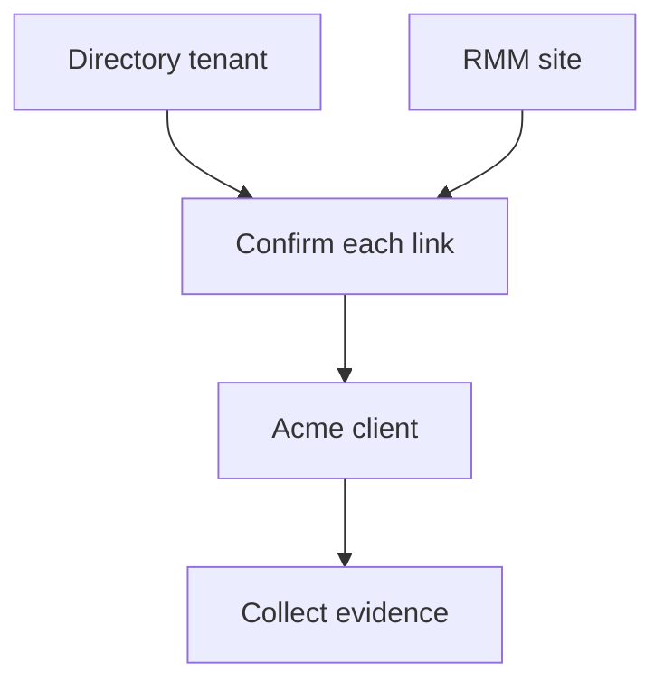

Your **tenant** is your MSP’s workspace. An **Organization** is one of your clients within it. The app calls these **Clients**; API paths use `organizations`.

A mapping answers one question: **which client owns this source company, tenant or site?** It does not establish whether that client passes a control.

## Import and link a client

You need access to clients and integrations, permission to manage mappings, and permission to create clients if you will add a new one.

<Steps>
  <Step title="Choose the source">
    Open **Clients → Import clients**. Choose a connected source in **Import source**. Where available, select **Refresh client records** to retrieve its current directory.

    **Checkpoint:** the source you selected is the one that holds the client records you intend to import. A simulated source uses saved example records and does not contact the provider.
  </Step>
  <Step title="Check the record's identity">
    Find the source company, tenant or site. Compare its displayed **ID** and name with the intended client's environment. A suggested match is a starting point for review; it has not linked the record for you.

    **Checkpoint:** you can explain why this source record belongs to this client, beyond a similar name.
  </Step>
  <Step title="Link or create">
    If the client already exists, choose it in **Choose client…**, then select **Link**. If it does not exist, select **Create** and complete the client form. Avoid creating a second client for another source that describes the same business.

    **Checkpoint:** the record is shown as linked to the intended client. Repeat for any other source records that belong to that client.
  </Step>
</Steps>

If the selected Microsoft connection requires a client assignment or consent before discovery, follow the instructions shown for that connection. Refreshing a directory does not grant customer access.

## Example: Acme across two sources

These names and source identifiers are illustrative. The two source records have different identifiers but belong to the same client.

| Source record | Illustrative source ID |
| --- | --- |
| Directory tenant: Acme Ltd | `tenant-acme` |
| RMM site: Acme HQ | `site-acme-hq` |

Keep one Acme client and link the appropriate source records to it. Several sites can belong to one client. Source IDs identify records in their source systems; the Alignr Organization ID identifies the client in your workspace.

## Review or correct an existing mapping

Open the connection under **Integrations**, then **Clients & sites**. Search by name or ID. **Assign client** links an unassigned record; **Change client** lets you review an existing assignment. **Refresh sites** retrieves the records accessible to that connection.

Before changing a mapping, confirm both the current and intended client. Reassigning a site changes where its future evidence belongs; do not assume that it repairs historical results. Inspect the affected clients and collect fresh evidence before relying on a new assessment.

## Mapping is not evidence collection

A **client-directory source** discovers client records but does not write evidence facts. For a source that collects evidence, return to its connection, use **Sync now** when available, and review **Sync history**. Then check that the observations belong to the intended client.

If the record is missing, first check the selected source, its accessible directory and any search filters. If the client is linked but observations are missing, follow [integration troubleshooting](/guides/troubleshooting#connected-but-no-results).

## Use an Organization ID in API or MCP requests

You can complete the app workflow above without an API key. For an API or MCP operation that asks for `organization_id`, use the `id` returned by [listing Organizations](/api-reference/introduction), rather than a client name or a vendor's tenant/site identifier.

Supplying an identifier does not give a key access to another MSP’s data.

## Before you continue

You should be able to identify the Alignr client, each linked source record and its stable source identifier. You should also know whether the source imports client records or collects evidence.

<Card title="Next: review the standard" icon="arrow-right" href="/guides/standards">Choose the expectations you want to assess for this client.</Card>
