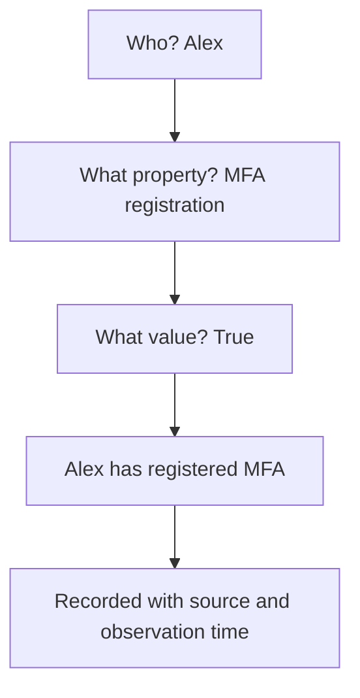

A **predicate** is the name of something Alignr can observe about a person, device, domain or other subject. Think of it as the label on a piece of evidence.

For example, `mfa_registered` means **“has registered a multi-factor authentication method”**. The predicate names the question; the fact supplies the answer for a particular subject.

## Read a fact like a sentence

| Part | Example | In plain English |
| --- | --- | --- |
| Subject | `alex@example.com` | Who or what are we talking about? |
| Predicate | `mfa_registered` | What do we know about them? |
| Value | `true` | What did the source report? |

Together: **“Alex has registered MFA.”**

The same observation also records the Organization, source, source reference, observation time and confidence. Those details tell you where the statement came from and whether it is suitable evidence for the assessment.

The diagram combines the subject, the property being observed and its value into one statement, then attaches the information needed to trace it back to its source.

## A predicate is not a verdict

`mfa_registered = true` does not mean “this client is secure”. It tells you about registration for this person. A control decides whether that observation meets a specific expectation.

| Observation | What it supports | What it does not establish |
| --- | --- | --- |
| MFA registered | A method has been registered. | Every sign-in requires MFA, or every registered method meets your policy. |
| EDR agent installed | The source reports an EDR agent. | The agent is healthy, up to date or reporting recently. |
| Backup product present | A backup product reports protection. | The last backup succeeded or a restore has been tested. |
| Device online | A source reports the device online. | Its patches, encryption or security posture are satisfactory. |
| SPF record present | A DNS observation found an SPF record. | Its content is correct or mail delivery is secure. |

Choose the observation that answers the actual question. A related observation is not a substitute.

## Values come in different forms

- **True or false:** `mfa_registered`, `account_enabled`, `device_encryption_enabled`.
- **A number:** `patches_pending`, `threat_open_count`, `licence_seats_purchased`.
- **Text or a state:** `os_platform`, `ca_policy_state`, `backup_job_state`.
- **A timestamp or date:** `last_sign_in`, `backup_last_successful_at`, `licence_renewal_date`.
- **A relationship or set member:** `has_role`, `member_of`, `has_licence`.

Use a matching value type in the control. For example, use the boolean `true` for MFA registration, a number for a patch count, and the actual observed state string for a status comparison. Vendor status vocabularies are not interchangeable.

## One value versus several values

Some properties describe one current value: a device has one reported last check-in time. Others can have several valid values at once: a user can belong to several groups.

For a set-valued predicate such as `has_role`, separate observations for “Global Administrator” and “Billing Administrator” can both be valid. They are not automatically a disagreement. An anchor matching a specific role can select the relevant subjects.

Do not assume every comparison automatically checks every member of a set. [Control conditions](/guides/control-conditions) explains the distinction between selecting a population and comparing a fact.

## False, zero and missing are different

| Evidence | Read it as |
| --- | --- |
| `mfa_registered = false` | The source reports that MFA is not registered. |
| `threat_open_count = 0` | The source reports zero open threats within its scope. |
| No `mfa_registered` fact | We do not have that observation. |
| An old MFA fact | We have an observation, but must check whether it is still usable. |

Missing evidence is not false, zero or a pass. It may mean missing source permissions, incomplete collection, an unmapped client or a predicate the connector does not provide.

## Why the names look technical

Names such as `device_last_checkin` are stable identifiers used by connectors, rules and API clients. Using one name lets multiple sources describe the same concept without each control needing a separate vendor-specific field name.

The readable label is an explanation; the identifier is what you select in the editor or use in code. You cannot add a new kind of evidence by typing an invented predicate name.

<Columns cols={2}>
  <Card title="Predicate reference" icon="book-open" href="/guides/predicate-reference">Look up the meaning of each registered observation.</Card>
  <Card title="Build a control" icon="list-check" href="/controls/create-custom">Turn observations into a clear expectation.</Card>
</Columns>
