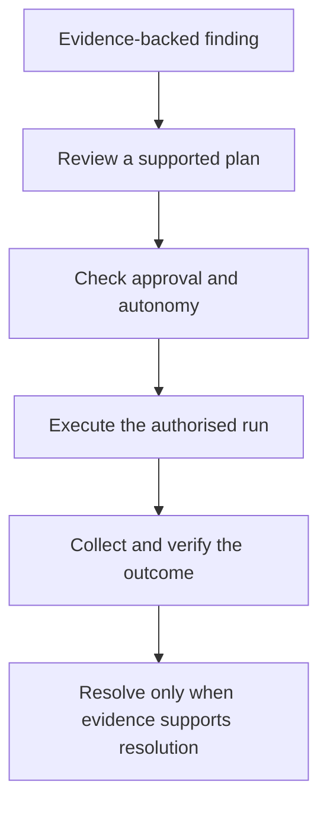

## Plans and runs

A remediation **plan** describes proposed steps. A **run** is one execution of a plan. Review the target, evidence, risk and available reversal before authorising a run.

## Approval and autonomy

The effective autonomy ceiling is the lowest of the rule, client contract, tenant and platform controls. An irreversible action requires a named human approver regardless of that ceiling.

The autonomy levels are `suggest_only`, `document_only`, `one_click`, `change_ticket` and `auto_fix_low_risk`.

## Verify the outcome

A completed action is not proof that the problem is resolved. Review post-action verification and fresh evidence. Where a supported reversal is available, check the run’s rollback information and window before relying on it.

Only use remediation actions supported by the specific finding and connected source.

## From finding to verified outcome

A queued request, an accepted action and a verified fix are different outcomes. Follow the run's reported state and supporting evidence rather than treating submission as success.

## What to review in a plan

| Question | Why it matters |
| --- | --- |
| Is this the correct client and target? | A technically correct change on the wrong target is still wrong. |
| Does the evidence support this action? | A plan must address the observed finding rather than a similar-looking symptom. |
| Is the action supported by the connected source? | Read access and evidence coverage do not imply write capability. |
| Who or what authorises execution? | Effective autonomy and required approval both apply. |
| What can be reversed, and when? | Reversal depends on the particular action and available rollback window. |
| What will prove the outcome? | A successful API response alone may not prove the control is now satisfied. |

## When the outcome is uncertain

Do not immediately repeat a change after a timeout or partial failure. Inspect the run and target state first: the action may have taken effect despite the missing acknowledgement. Escalate with the run identifier and safe diagnostic details, and use a supported rollback only after reviewing its effect.
