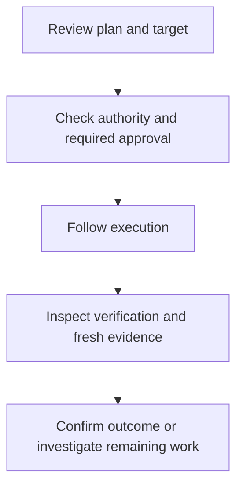

A remediation **plan** describes proposed steps. A **run** is one execution. Start from an open [issue](/guides/triage-issues), review the target and evidence, then follow the outcome in **Activity → Fix history**.

An external MCP assistant can read a [bounded plan outline and run status](/mcp/tools) for a handover. With separate user-owned key scopes and current owner permissions, it can also [preview one exact plan and submit a pending human review request](/mcp/request-review). Those calls do not approve or execute a change. Use this signed-in workflow for the full plan, human approval and action.

## Review and request a fix

You need `remediation.execute` to request execution. Open the issue and inspect the plan's steps, client, target integration, risk note and effective authority. Where a step asks you to choose its target, verify the source and subject before saving the selection.

Select the issue's primary action, whose label describes the supported fix, then review the confirmation before proceeding. A disabled action includes a reason: a closed or snoozed issue, an unsupported plan, incomplete target selection, authority limits or pending verification can prevent another run.

**Checkpoint:** the request has a visible run state. Submission is not proof that the action executed or that the finding was fixed.

An assistant can alternatively submit the exact plan to this same pending approval queue through the [MCP review-request workflow](/mcp/request-review). It needs a fresh preview revision and a recorded idempotency UUID; an uncertain response must be retried only with the identical request and key. The named human still reviews and decides the approval here. A later execution can refuse if the target or plan changes.

Approval, execution and verification answer different questions. Keep all three visible in your handover.

## Decide an approval

A run awaiting approval has not started its actions. Open **Activity → Approvals**, select **Pending**, then **Review** the request.

Use **Search approvals…** to find a request by issue title or reference, Organization name, or the requester’s displayed name. Search ignores letter case and outer spaces, accepts up to 200 characters, and treats `%` and `_` literally. Keep **Pending** selected for outstanding decisions, or choose **Approved**, **Declined** or **All** to inspect history.

Select **Request**, **Organization**, **Requested by**, **Requested** or **Status** to sort the whole matching queue. Each heading cycles through ascending, descending and the default with no sort arrow. On a narrow screen, use **Sort approvals** for the same orders. Text sorts ignore letter case. Request and Organization entries with unavailable context appear last in either direction; a missing requester uses the displayed **System** label. Status sorts by the displayed label, and Requested sorts by creation time.

The default is newest requested first, with a consistent order for equal values. Results are returned in pages of 25 after search, status filtering and sorting. Changing any of these controls returns to page one. **Reset view** restores **Pending**, empty search and the default order. These controls only change which requests you see; open **Review** or **View** to inspect an individual request.

Viewing requires `approval.read`; deciding requires `remediation.approve`. The person who requested the run cannot approve their own request. Ask a different authorised approver to review it.

1. Wait for the current run and proposed fix to load. Confirm the client, finding, proposed steps, risk and each displayed action and target. Account or client resource targets appear where the action requires one. **Approve** stays unavailable if that review context fails to load or a required target is missing; use **Retry review details** after a load error. **Decline** remains available to an authorised reviewer.
2. Select **Approve**, then **Approve & run** to queue the proposed fix under your name as approver. Approval cannot be withdrawn from this screen once submitted.
3. Alternatively, select **Decline**. Add the optional note to explain the decision to the requester. Declining closes the pending run as failed without executing it. An authorised requester may decline their own request.

**Approved — run enqueued** confirms queueing for that request, not successful execution. If refreshed review details show a changed plan or target, the confirmation closes and you must review it again. The server checks the plan fingerprint and target before execution; an approved, queued run may still refuse to act if they changed. Follow the run in Fix history. If approval or execution fails because the plan, target or limits changed, review the current state before requesting a fresh action.

## Read fix history

Open **Activity → Fix history**; the page is titled **Remediations** and requires `remediation.read`.

Use **Filter by organization** to find a client by name or slug. The picker loads 25 choices at a time; select **Load more** to browse further. This searches the client directory, separately from **Search remediations…**, which searches run details. Browsing the directory requires `organization.read`; if you do not have it, the picker explains why and keeps an existing page filter.

A client-specific link opens Fix history with that Organization selected. The page filter defines the client scope. **Clear filters** removes the page-specific selection and returns to all clients; no global client filter is applied.

Use **Search remediations…** to find a run by its action summary, issue title or reference, or Organization name. Search ignores letter case and outer spaces, accepts up to 200 characters, and treats `%` and `_` as ordinary characters. Combine it with the **Organization** and **result** filters to narrow the whole history, including runs beyond the current page.

Select **Action**, **Organization**, **Detection**, **When** or **Result** to sort the matching runs. The first click sorts ascending, the second descending, and the third restores the default with no sort arrow. On a narrow screen, use **Sort remediations** above the cards for the same choices.

| Heading | What determines the order |
| --- | --- |
| Action | The action summary, falling back to the issue title. |
| Organization | The client name. |
| Detection | The displayed issue reference. |
| When | Start time, falling back to finish time; runs without either date appear last in both directions. |
| Result | The primary run-state label, separate from verification and simulation badges. |

The default shows the newest **started** runs first, with unstarted runs last. Text sorting ignores letter case, and equal values have a consistent order. Search, filters and sorting apply before the server returns each page of 25 runs. Changing any of them returns to page one. **Clear filters** restores all Organizations, all results, empty search and the default order.

For example, search for fictional **Acme**, choose **Failed**, then sort **When** descending to inspect its most recent failed runs. Searching or sorting does not retry a run or change its rollback eligibility.

| Run state | What to check |
| --- | --- |
| Awaiting approval | The decision is still outstanding. |
| Running | Execution is in progress; closing the confirmation window does not stop it. |
| Completed | Read the separate verification result before claiming resolution. |
| Partial | Some steps did not complete. Investigate what was applied and what remains. |
| Failed | Inspect the outcome before attempting another action. |
| Rolled back | A supported reversal was performed; review the current environment and evidence. |

Completed runs also show a verification label:

- **Verified fixed:** post-action verification supports resolution.
- **Control still failing:** the action did not establish the expected outcome.
- **Awaiting verification:** do not yet claim a verified fix.
- **Manual verification needed:** complete an appropriate human check.
- **Includes simulated steps:** review the scope carefully. Other steps in the same run may have changed live client systems.

For example, a fictional Acme run may complete its action while fresh evidence still shows a failing setting. Report “action completed; control still failing”, rather than “fixed”.

## Roll back a supported change

With `remediation.rollback`, find the run in Fix history and select **Roll back** where available. Review the confirmation, then confirm **Roll back** to reverse the changes where supported.

Availability depends on the run's actual eligibility and rollback window. A disabled button explains the block; the workspace's default window alone does not guarantee that every action is reversible. Inspect the resulting status and current target state after requesting reversal.

## Understand authority limits

Effective autonomy is the lowest of the control, client contract, tenant and platform limits. Irreversible actions require a named human approver regardless of that ceiling.

| Level | Meaning for a supported action |
| --- | --- |
| Suggest only | A person carries out the suggested change. |
| Document only (legacy) | Prevents live changes. |
| One-click | Execution follows a person's confirmation. |
| Change ticket | Execution requires the approval workflow. |
| Auto-fix low risk | Supported low-risk actions may run without separate confirmation each time. |

These limits do not add write capabilities to a connector. A control that can detect a failure may have no supported automatic fix.

## Recover from an uncertain outcome

After a timeout or partial failure, inspect the run and target before repeating the action. Some changes may already have taken effect. Keep the run identifier, applied steps, verification status and safe diagnostic details in the handover.

Collect fresh evidence and reassess as appropriate. If no supported action or verification exists, use your approved operational process and record its scope and outcome. See [Activity and audit history](/guides/daily-review#inspect-activity-and-export-audit-history) to investigate recorded actions.
