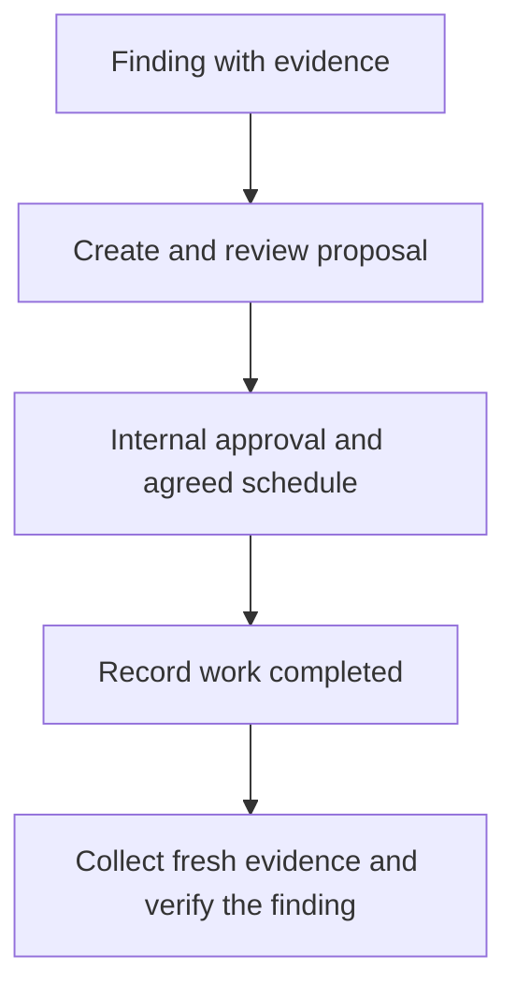

Open **Risk register** or **Roadmap** from a client to work in that client's context. The workspace-level pages can show several clients; confirm the selected client before making a decision.

The risk register separates detected risks from manual assessment failures. A risk decision records what you intend to do about a finding. It does not replace the observation that produced it.

In **Detected risks**, search by risk name, reference or client, then combine **Filter by severity** with **Filter by decision**. Sort by **Highest risk** (rank score, with severity as a tie-breaker), **Highest severity** or **Risk name A to Z**. The result count reflects the filtered detected-risk collection; choose 25, 50 or 100 rows per page. These controls apply to detected risks only; manual assessment risks remain in their separate section.

## Choose the right response

| Situation | Action |
| --- | --- |
| A supported finding needs investigation or repair | Inspect its evidence and use the appropriate [remediation workflow](/guides/remediation). |
| The residual risk is deliberately accepted for a period | Use **Accept risk**, with a reason and future expiry. |
| Improvement needs a proposal, cost or delivery plan | Use **Create proposal** to add it to the roadmap. |
| A human assessment failed | Review its evidence and assign [follow-up work](/guides/client-reviews). |

Viewing detected risks requires the relevant finding access; formal acceptance requires `detection.write`. Creating and changing roadmap items requires `roadmap.write`; creating a proposal from a detected risk additionally requires `detection.read`. Reading roadmap items requires `roadmap.read`. Available actions reflect your permissions.

## Record a risk acceptance

Open the detected risk's action menu and select **Accept risk**. Explain **Why is this being accepted?** and set **Accepted until**, then confirm. Both a reason and a future expiry are required.

For example, a client might accept a supported finding temporarily while a replacement is scheduled. Record the agreed reason and review date; do not describe the acceptance as proof that the environment meets the control.

Use **Acceptance history** to inspect earlier decisions. An acceptance can lapse. Review an expired acceptance rather than relying on an old approval indefinitely.

## Create a proposal from a finding

Select **Create proposal** from the detected risk's action menu. Review the estimated cost and any target quarter. The new item remains linked to the source finding. If a proposal already exists, open it through the roadmap action instead of creating another.

Creating a proposal does not accept or resolve the risk. Review the proposal before approving it; timing can remain unscheduled until a delivery quarter is agreed.

## Manage the roadmap

Use the client's **Roadmap** to add a standalone item when planned work has no source detection. Enter its title, category, severity, unit cost in pounds, quantity, recurring term and target quarter where known. Edit an existing item to correct those details.

Read the estimate as **unit cost × quantity**. For example, a fictional £100 unit cost with quantity three represents £300 for the selected term. One-off, monthly and annual costs are shown separately; they should not be read as one comparable annual total.

| Decision | Meaning |
| --- | --- |
| Proposed | Work is awaiting an internal decision. |
| Approved | The MSP has approved the planned item. Review its schedule separately. |
| Rejected | The proposal is declined; its source risk is unchanged. |
| Work completed | Delivery is recorded; fresh evidence is still needed to verify the source finding. |

Use the item's decision action to record its state and the requested decision note, and **View history** to inspect changes. Rejected and completed decisions require a note. A scheduled quarter is a plan, not proof that work happened.

The last step is essential: changing a roadmap state does not change the source result. An approved plan is also distinct from permission to execute a remediation action.

## Client responses are separate

An authorised client can respond to a visible proposal through the [client portal](/guides/client-portal). That response records their approval or decline. It does not change the MSP's internal roadmap approval or execute the work.

## If a decision is blocked or unclear

- Confirm the client, current finding and any existing roadmap link.
- If an acceptance is rejected, check the reason and future expiry.
- If a roadmap change is rejected, inspect the current item and required fields or decision note before retrying.
- If the estate view reports incomplete or stale data, refresh the failed client data before treating its totals as complete.
- After delivery, reassess the source evidence instead of expecting the risk to disappear when the work is marked completed.

**You should now have:** an explainable decision, a deliberate plan where needed, and a verification step. Include the remaining risks and agreed work in the next [client report](/guides/client-reports).
