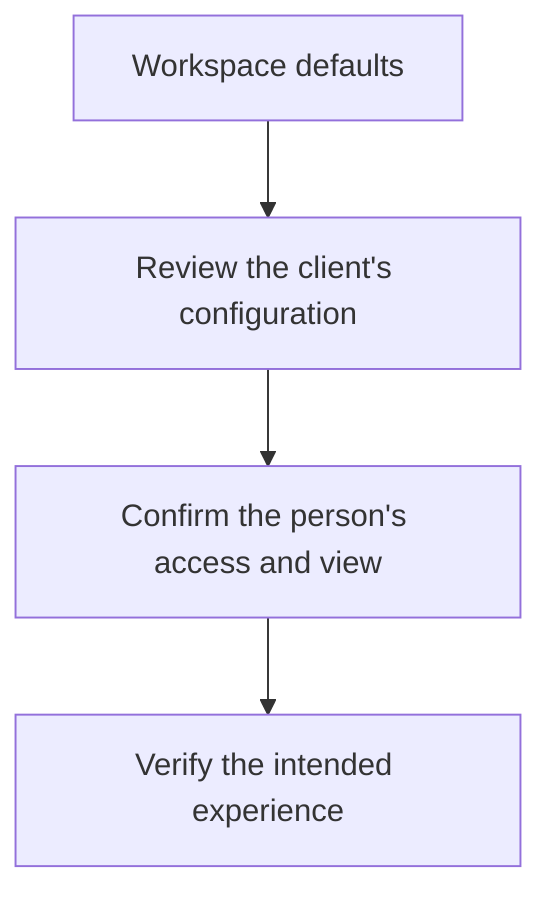

Open **Settings** for the workspace directory. It groups related pages into **Workspace**, **Access** and **Client services**. Links are shown according to your permissions; being able to view a page does not necessarily let you change it.

## Workspace

| Page | Use it to | What completing it means |
| --- | --- | --- |
| **Setup checklist** | Find the next setup tasks for your MSP workspace. | Review each milestone; a completed connection is not a completed assessment. |
| **Workspace health** | Investigate connection and evidence health. | Identify the source or evidence problem to resolve before relying on results. |
| **Account** | Manage your profile, authenticators and workspace authority settings. | Confirm the profile, security key or policy change was saved. |

Setup checklist and Workspace health require `dashboard.read`. Account is available to signed-in workspace users, with individual changes permission-gated.

Follow the [setup wizard](/guides/setup-wizard) for initial configuration or [Workspace health](/guides/workspace-health) to investigate an existing workspace.

Use [Your account and team](/guides/account-and-team) for account security and colleague onboarding.

## Access

| Page | Use it to | Access boundary |
| --- | --- | --- |
| **Team members** | Invite colleagues and review their roles, status and effective permissions. Opens the Users page. | `user.read` to view; `user.manage` to change users. |
| **Roles & permissions** | Define the reusable permissions assigned to colleagues. Opens the Roles page. | `role.read` to view; `role.manage` to change custom roles. System roles are protected. |
| **MCP/API Tokens** | Create credentials for supported API or assistant workflows. | Select only the scopes needed for the task; tokens are separate from a human's password. |

Start with [inviting teammates](/guides/account-and-team#invite-a-colleague) for human access, or [API keys](/guides/api-keys) for a programmatic connection. An API token is not required to use Alignr's app.

## Client services

### Microsoft

Open **Settings → Microsoft** to choose your usual connection method. Viewing requires `integration.read`; saving defaults or authorising a partner connection requires `integration.manage`.

- **Direct · authorise each client:** save the default, then finish authorisation in each client's **Connections** tab. Direct connections support identity and Intune device checks.
- **Partner Center · use your partner account:** select an enabled live partner connection, or use **Add partner connection**. **1. Request admin consent** records an administrator's return; **2. Authorise partner account** completes the separate delegated sign-in. Select **Save Microsoft defaults**, then assign Microsoft customers and check each client's access. A consent return alone is not a verified grant.

Follow [Microsoft connections for each client](/guides/client-microsoft-connections) for the full default and override walkthrough, including clients outside your partner relationship.

The partner identity connection and the separate Partner Center directory/subscription connection serve different jobs. For Intune device checks, choose Direct for that client.

**Checkpoint:** the page reports **Microsoft defaults saved**. Next, open a client to finish its connection. Saving a default does not grant customer consent, complete mapping or collect evidence.

The shared Direct and Partner Center applications are configured separately. If a route says its shared application is unavailable, ask your deployment administrator to configure that route. A custom Direct application is supported for client-specific direct setup; it does not replace the Partner platform registration.

### Client portal

Open **Settings → Client portal** to configure how your MSP presents information to clients. Viewing requires `portal.read`; changing settings requires `portal.write`.

<Steps>
  <Step title="Set the portal address">
    Enter the **Portal domain** and select **Save address**. Use the domain connected to your portal deployment.

    Saving an address does not configure hosting, DNS or Microsoft consent. Complete those external prerequisites before sharing **Open client sign-in**.
  </Step>
  <Step title="Choose default sections">
    Under **Portal sections**, choose the included sections and their order: **Compliance**, **Risks**, **Roadmap** and **Expirations**.

    These are workspace defaults. Existing client-specific overrides are preserved.
  </Step>
  <Step title="Define named views when needed">
    Under **Named client views**, create a view for a particular audience. Choose its sections and whether to **Show introduction** and **Show roadmap costs**, then **Save view**.

    Creating a view defines presentation. Choose client sign-in access and person-specific views from the relevant client before sharing it.
  </Step>
  <Step title="Review brand presentation">
    Set **MSP name**, **Light-background logo** and **Dark-background logo**. Inspect both background previews. If only one logo is supplied, it is used for both backgrounds.

    Your MSP identity is presented within Alignr's portal layout.
  </Step>
</Steps>

**Checkpoint:** the saved settings are correct, the intended client and person have the right access and view, and the portal's sign-in and hosting prerequisites have been verified. A saved logo or domain alone does not mean the portal is ready for clients.

If a named view changed elsewhere while you were editing, refresh the saved views and compare them with your draft before saving again.

## Keep the scopes clear

Workspace settings establish defaults and shared policies. Client configuration and person-level access still need their own review. This applies especially to Microsoft connections and client-portal sharing.

<Card title="Continue: your first client assessment" icon="clipboard-check" href="/journeys/first-assessment">Connect the setup decisions to evidence, controls and an explained result.</Card>
