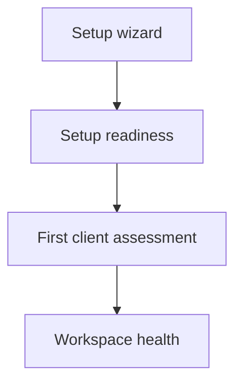

The setup wizard takes you through the essentials in one place. Creating a workspace opens it automatically. To return, choose **Settings → Setup checklist**, or [open the wizard](https://app.alignr.io/setup) after signing in.

You can select any step, use **Skip for now**, or **Finish later** and return. Work through the steps with a workspace administrator if your role cannot manage connections, invite people or build standards.

## Walk through the four steps

<Steps>
  <Step title="Microsoft partner access">
    Connect your MSP's Microsoft partner account to access customer directories through your authorised relationships. Prepare a dedicated account in the partner tenant, keep MFA enabled and review the required access before authorising.

    A partner connection does not create customer consent or a GDAP relationship. For clients outside your Partner Center, use the [client Microsoft connection guide](/guides/client-microsoft-connections) to choose a direct connection.

    After authorisation, review and import customer Organizations. Your own staff directory is handled separately in the teammate step.
  </Step>
  <Step title="Connect your PSA">
    Choose your service tool and enter its API credentials in the connection form. Review the saved connection and match its client records to the right Alignr clients.

    Connecting a client directory is different from collecting assessment evidence. Follow the [integration guide](/guides/integrations) to check what each source supplies.
  </Step>
  <Step title="Invite your teammates">
    Select **Invite a teammate**, enter their details and choose their Alignr role. They set their own password using a single-use invitation link.

    You can also preview your MSP's Microsoft staff directory when your permissions allow it. Review each proposed invitation and role; previewing the directory does not send invitations. See [accounts and teammates](/guides/account-and-team).
  </Step>
  <Step title="Set up your standards">
    Choose **Build a guided baseline → Choose standards** to select identity, device, backup and manual review areas. Or choose **Use an existing checklist → Import checklist** to bring an Excel or CSV checklist into an inactive standard.

    Both paths require review before enabling checks. Select **Finish setup** when you are ready to leave the wizard.
  </Step>
</Steps>

Follow [Build or import a standard](/guides/build-or-import-standard) for the guided questions, spreadsheet format and draft review steps.

## Check what is actually ready

On the final screen, choose **Review setup readiness**. This checks progress towards live assessment coverage rather than simply counting the wizard steps you visited.

| Readiness step | What to check |
| --- | --- |
| Add clients | Your clients exist and source records are matched correctly. |
| Connect tools | A live tool has successfully collected information. A saved connection alone is insufficient. |
| Choose standards | A standard with checks is ready for use. |
| Run first checks | Review, enable and run a standard; inspect current live results and any coverage gaps. |

Passing and failing controls both count as assessed. Completing the wizard, or reaching full setup readiness, does not mean every control passed.

<Note>
You can start with manual reviews without connecting a source. The readiness progress tracks live automated coverage; record manual reviews separately in the client's controls.
</Note>

## Know which page to use next

The wizard helps you configure the workspace. Readiness checks whether it can produce assessments. The first-assessment journey teaches you to interpret a result. Workspace health helps you keep collection, coverage and follow-up work current.

**Your checkpoint:** you know which connections and clients you have configured, what still needs attention, and which standard you will assess first.

Continue with [Your first client assessment](/journeys/first-assessment), or use [Workspace health](/guides/workspace-health) to investigate an existing workspace.
