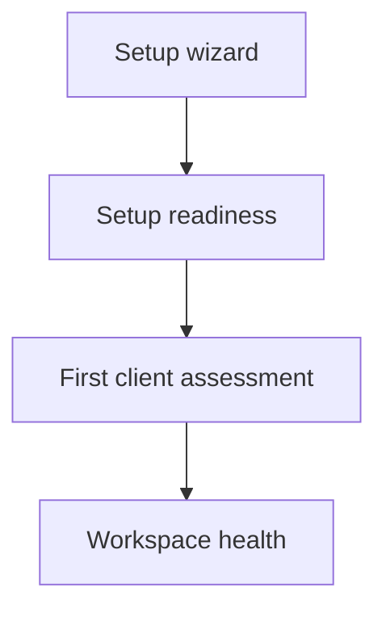

The setup wizard takes you through the essentials in one place. Creating a workspace opens it automatically. To return, choose **Settings → Setup**, or [open the wizard](https://app.alignr.io/setup) after signing in.

The left sidebar provides the main workspace destinations. The top-left workspace menu links to shared settings, teammates and billing when permitted, and also contains **Account settings** and **Sign out** for your personal account. In Settings, **Setup** opens this wizard again. You can select any step, use **Skip for now**, or **Finish later** and return. Work through the steps with a workspace administrator if your role cannot manage connections, invite people or build standards.

See the [visual tour](/journeys/visual-tour) to recognise these screens before you start.

## Walk through the five steps

<Steps>
  <Step title="Microsoft partner access">
    Connect your MSP's Microsoft partner account to access customer directories through your authorised relationships. Prepare a dedicated account in the partner tenant and keep MFA enabled. After selecting an enabled live partner connection, use **1. Request admin consent** for an administrator to review the request, then **2. Authorise partner account** for the separate partner sign-in. A return from the first step is not proof of access; check each customer's access after connecting it.

    A partner connection does not create customer consent or a GDAP relationship. When adding that connection, **Find tenant ID by domain** can look up your MSP partner tenant ID from its Microsoft domain. Confirm the returned ID before use; the lookup does not prove ownership or grant consent. For clients outside your Partner Center, use the [client Microsoft connection guide](/guides/client-microsoft-connections) to choose a direct connection.

    After authorisation, review and import customer Organizations. Your own staff directory is handled separately in the teammate step.
  </Step>
  <Step title="Connect your PSA">
    Choose **ConnectWise Manage**, **HaloPSA** or **Autotask**, then enter its API credentials in the connection form. Review the saved connection and match its client records to the right Alignr clients.

    PSA client records can be reviewed under **Clients → Import clients** to create or link Alignr clients. Connecting a client directory is different from collecting assessment evidence. Follow the [PSA and RMM guide](/integrations/psa-rmm) to check what each source supplies.
  </Step>
  <Step title="Connect your RMM">
    Choose **Datto RMM** or **NinjaOne** for device observations. **ConnectWise Automate** is shown as unavailable. These are RMM sources, separate from the PSA and its service-ticket context. Enter credentials in the connection form, then review and match source sites or organisations to the right Alignr clients.

    RMM sites or organisations can also supply client records under **Clients → Import clients**; review each and create or link the correct Alignr client. Importing a client does not prove device evidence is current. Collect, check the source and observation time, then run a reviewed standard. See [Organizations and clients](/guides/organizations) for the import decisions. You may skip this step and return to it later.
  </Step>
  <Step title="Invite your teammates">
    Select **Invite a teammate**, enter their details and choose their Alignr role. They set their own password using a single-use invitation link.

    You can also preview your MSP's Microsoft staff directory when your permissions allow it. Review each proposed invitation and role; previewing the directory does not send invitations. This is step four, separate from importing customers in step one. See [accounts and teammates](/guides/account-and-team).
  </Step>
  <Step title="Set up your standards">
    In the Standards step, choose a domain card to open its dedicated setup page; start with **Identity** or choose another area. This page sits outside the workspace wizard. **← Setup** returns to the Standards step. Answer one question at a time, including only the checks that fit your policy. The questionnaire asks about identity, managed-device recency and protections, or backup errors and recency according to the chosen domain. A **No** answer leaves that check out; **Yes** may reveal a setting such as the account population or time window. Email & domains is a human review with instructions and a review interval, not an automated email-security claim. Connect relevant tools, review the complete check list, then save the standard. Guided domain standards are active when saved, with no clients assigned yet. Add Devices, Backup or Email & domains as separate standards when you are ready.

    If custom standards already exist, the wizard offers **View standards** and **Choose another domain**. The domain chooser shows its saved standards and their On/Off state, so you can review existing work before building another.

    Connector selection starts with tools relevant to the chosen domain. You can switch to any available category or **All tools**. Reuse existing connections and match their client records; saving a connection is separate from collecting evidence and running checks. If you add a connector or open **Match clients**, the return link brings you back to this domain setup, rather than sending you to an arbitrary URL.

    The domain page has three stages: **Questions**, **Sources** and **Review**. The question rail labels each item **Current**, **Current · Yes/No**, **Yes**, **No**, **Up next** or **Locked**. You can return to answered questions and move to the next question; later questions and stages stay locked until their prerequisites are complete. The stage navigation lets you revisit completed stages.

    Unfinished answers are restored from browser storage for the same account, workspace and domain. After saving, open the standard and choose **Deploy to clients** to select which clients it applies to. Saving assignments does not run checks. **Run checks** is a separate assessment step, available after at least one client is assigned. The guided page is distinct from the server standard until you save it. Library copies, checklist imports and new blank/general standards remain disabled and workspace-wide by default; existing standards keep their saved scope. After saving, use **Return to Standards setup** if you want to continue the workspace wizard, then select **Finish setup** when ready. [Checklist import](https://app.alignr.io/standards/import) remains available separately.
  </Step>
</Steps>

Follow [Build or import a standard](/guides/build-or-import-standard) for the guided questions, spreadsheet format and draft review steps.

## Check what is actually ready

On the final screen, choose **Review setup readiness**. This checks progress towards live assessment coverage rather than simply counting the wizard steps you visited.

| Readiness step | What to check |
| --- | --- |
| Add clients | Your clients exist and source records are matched correctly. |
| Connect tools | A live tool has successfully collected information. A saved connection alone is insufficient. |
| Choose standards | A standard with checks is ready for use. |
| Run first checks | Review, enable and run a standard; inspect current live results and any coverage gaps. |

Passing and failing controls both count as assessed. Completing the wizard, or reaching full setup readiness, does not mean every control passed.

<Note>
You can start with manual reviews without connecting a source. The readiness progress tracks live automated coverage; record manual reviews separately in the client's controls.
</Note>

## Know which page to use next

The wizard helps you configure the workspace. Readiness checks whether it can produce assessments. The first-assessment journey teaches you to interpret a result. Workspace health helps you keep collection, coverage and follow-up work current.

**Your checkpoint:** you know which connections and clients you have configured, what still needs attention, and which standard you will assess first.

Continue with [Your first client assessment](/journeys/first-assessment), or use [Workspace health](/guides/workspace-health) to investigate an existing workspace.
