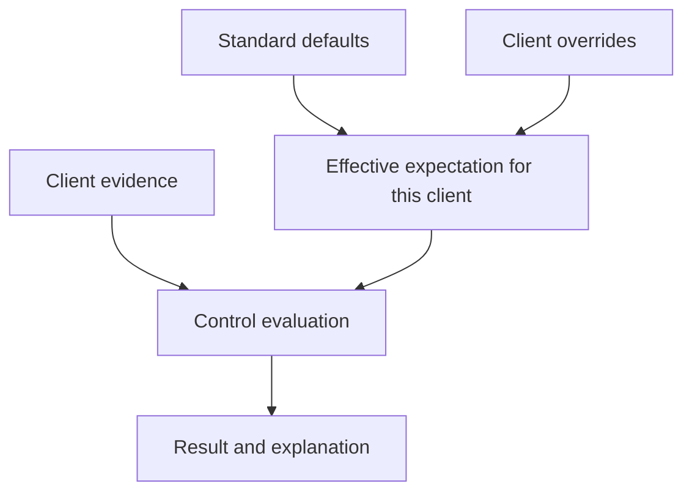

A **standard** groups expectations you want clients to meet. A **control** checks one expectation. For example, an identity standard might include a control requiring observed Global Administrators to have MFA registered.

## Choose a starting point

| Starting point | Best when |
| --- | --- |
| Guided domain setup | You want to set expectations one question at a time and choose relevant sources for Identity, Devices, Backup or Email & domains. |
| Library template | You want to copy a reviewed set of supplied controls. |
| Spreadsheet import | You already have a human questionnaire to turn into manual checks. |
| Blank standard | You need to define a bespoke set of expectations. |

On **Standards**, select **Create standard**, then choose a guided domain to build one area at a time. The guided builder lets you include or leave out each check, then review the full selection before saving an active standard with selected-client scope and no clients assigned. Existing standards for each domain are listed before you create another. From workspace setup, **Choose a domain** opens the same chooser.

The compact Standards list searches by name, slug, description or setup domain and filters by **All states**, **Enabled** or **Disabled**. Each row shows the standard name, domain, check count, client count and enabled state. Select a row to open full details; choose **← Standards** to return with the search, state filter, page and page size you were using. The app list has no separate sort control. Select **More standards actions** for the library, **Run checks** or **Blank standard**. The REST `GET /standards` endpoint accepts `q` (up to 200 characters), `enabled`, `sort`, `page` and `pageSize` (1–100). Filtered, sorted or paged requests default to page 1 with 25 rows; only an unparameterized `GET /standards` retains the existing complete-list response for older callers.

Follow [Build or import a standard](/guides/build-or-import-standard) for guided setup and questionnaire import, or [choose a library baseline](/controls/baselines/overview). Guided standards are active on save and need explicit client assignments before checks can run. New blank/general standards, library copies and imported checklists remain disabled and workspace-wide by default; existing standards keep their saved scope.

On a standard’s **Sources** tab, **Client source readiness** lists clients by name. Open a requirement count to see the observations a check needs. Evidence-gap and client-gap actions show possible sources and connection steps. If client names cannot load, use **Try again** before choosing a client. Source readiness is separate from current evidence and passing checks.

## Separate the question from the evidence

Before creating a control, write the expectation in plain English and identify the observations needed to answer it.

| Expectation | Relevant evidence | What else needs a separate check? |
| --- | --- | --- |
| Administrators have MFA registered. | Role membership and MFA registration. | Effective sign-in enforcement and acceptable methods. |
| Managed devices report within an agreed period. | Management relationship and last check-in. | Patching, encryption and EDR health. |
| A recent backup succeeded. | Relevant backup job/workload and last success. | Successful restoration of the required data. |

The [predicate reference](/guides/predicate-reference) helps you choose the right observation rather than a nearby concept.

## Global expectations and client settings

The effective expectation combines the standard's settings with the client's overrides. A result must be explained using that effective setting, not a default that no longer applies.

For example, one client may have an agreed reporting threshold that differs from the default. Review the override's reason and the effective threshold when interpreting a result. A disabled control is not proof that the underlying environment meets the expectation.

## Apply a standard deliberately

For a guided standard, open its details, choose **Deploy to clients**, select the clients it should apply to and **Save assignments**. Saving assignments changes applicability; it does not run checks. **Run checks** requires an enabled standard with an enabled automated check, an applicable active client, and permission to run checks. The run dialog starts with the standard's applicable active clients selected; you can narrow this run to a subset without changing assignments or the standard's saved scope.

<Steps>
  <Step title="Choose the client outcome">Identify the technical expectations you want to assess and who owns the follow-up.</Step>
  <Step title="Review the controls">Read each population, required fact, comparison and default parameter. Use the built-in standard as a starting point, not evidence of client compliance.</Step>
  <Step title="Check coverage">Confirm which observations connected and mapped sources can supply for this client. Plan suitable manual checks for expectations that need human assessment.</Step>
  <Step title="Review exceptions">Check client-specific parameters and enabled states. An exception should be deliberate and explainable.</Step>
  <Step title="Evaluate and inspect">Select **Run checks** from Standards, review the selected clients and settings, and confirm the run. Read the results, evidence and evaluation time. Investigate both failures and gaps.</Step>
</Steps>

Use **Select all** or **Deselect all** in the assignment dialog to update the visible list. When searching, these actions affect matching clients; other assignments are preserved. Select **Save assignments** to apply the changes.

## Enable a reviewed draft

A copied library template, checklist import or new blank/general standard starts disabled and workspace-wide by default. Open its standard details and select **Review & enable**. In the editor, turn on **Enabled** and select **Save changes** after reviewing the controls and manual checks. Confirm the standard is enabled before opening **Run checks**; the final run action is unavailable for a disabled standard. Guided domain standards follow a different path: they are active on save, start with selected-client scope and require explicit assignments.

For a scoped assistant workflow, a user-owned key can [preview the complete copied draft and activate that exact revision](/mcp/activate-standard-draft). That action enables the workspace default, including future clients; existing client overrides still apply. It does not run checks or establish a passing result. A separate [one-client evaluation request](/mcp/evaluate-one-client) can assess the automated controls of one enabled standard against available evidence for a client within its scope. It does not change assignments or complete manual checks. Confirm that those evaluation tools appear in the live reference before using them.

## After a standard changes

Supported changes to a standard's control definition, parameters or enabled state, the standard's enabled state, a client's effective control override, or the standard's client assignments can queue an automatic reassessment for affected clients. Cosmetic control changes do not queue this work. Reassessment runs asynchronously, so completion depends on worker availability and queue load; there is no guaranteed completion time.

It evaluates existing eligible evidence and does not collect fresh vendor data or complete manual reviews. If required evidence is missing, stale or unavailable, the result remains unknown or uncovered rather than treating the control as passed. Use **Refresh evidence** when new source observations are needed, then review the resulting assessment.

A client removed from the assignment or archived before processing is skipped. Recorded issues use a separate detection workflow, so this reassessment does not immediately create, close or otherwise synchronise them.

## Read the run outcome

From **Standards**, **Run checks** collects through sources mapped to the selected clients, then evaluates that standard for those clients. Some connected sources may read an account-wide provider inventory, but this run publishes evidence and results only for selected clients. It does not change assignments. You can search the client list, select or deselect visible matches, and run checks for 1–200 clients at a time. Every selected client must remain active, be applicable to the standard and have a mapped evidence source. A connection-wide refresh remains available separately when you need to refresh every client on a source. If a run request's outcome is uncertain, reopen the same standard's dialog and check its original request before starting another run; see [Run checks for selected clients](/api-reference/run-scoped-standard-checks) for recovery details.

You can open **Issues** before the run finishes. Rule-based standard batches save each verified finding as it is ready, then continue across the selected clients. The queue refreshes automatically while open. Refuted candidates do not appear as open issues, and the run stays in progress until its remaining checks finish. AI-assisted standards may publish findings in groups.

Verification uses each client’s effective control settings, including overrides. For example, an account last seen 45 days ago fails a 30-day inactivity window but meets a 90-day window. A failed control becomes an issue only when its cited evidence supports that finding.

| Outcome | What to do |
| --- | --- |
| Automated results were recorded. | Open the client's results and inspect the evidence and evaluation time. A completed run does not imply all controls passed. |
| A run was recorded with no automated results. | Review the standard's contents and enabled controls. If it contains manual checks, complete those assessments separately. |
| Some clients completed and others failed. | Review each client's outcome. Preserve successful results and investigate the reported failures before deliberately retrying. |
| Evidence is missing or stale. | Return to the relevant integration, resolve collection or coverage, confirm new evidence, then evaluate again. |

**Checkpoint:** you can distinguish a recorded run from recorded control results, and explain which clients still need attention.

## Automated and manual checks

An automated control compares observations. A manual check records a human assessment where the question needs judgement or evidence not available through the supported source.

For example, an observed successful backup is useful, but a restore exercise answers a different question. Keep the manual evidence, conclusion and follow-up clear. Do not disguise unavailable automation as a pass.

## Changing a standard

Changing a threshold changes the question being asked. Review affected clients and overrides, then evaluate again. Historical evaluations describe the settings/version used at the time; a later edit does not make an earlier result evidence for the new expectation.

## Explore controls

Use the [Controls section](/controls/overview) for practical creation guides, client settings and manual assessments. Browse [baseline categories](/controls/baselines/overview) for every supplied control and manual check, including defaults and interpretation limits.

## Read next

- [How control conditions work](/guides/control-conditions): population, operators and worked examples.
- [Understanding control results](/guides/control-status): pass, fail, missing evidence and exemptions.
- [Troubleshoot an assessment](/guides/troubleshooting): work backwards from an unexpected result.
