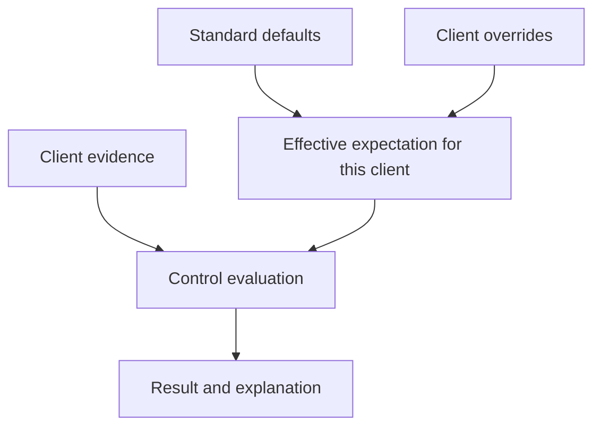

A **standard** groups expectations you want clients to meet. A **control** checks one expectation. For example, an identity standard might include a control requiring observed Global Administrators to have MFA registered.

## Choose a starting point

| Starting point | Best when |
| --- | --- |
| Guided baseline | You want to choose managed areas and answer focused setup questions. |
| Library template | You want to copy a reviewed set of supplied controls. |
| Spreadsheet import | You already have a human questionnaire to turn into manual checks. |
| Blank standard | You need to define a bespoke set of expectations. |

Follow [Build or import a standard](/guides/build-or-import-standard) for guided setup and questionnaire import, or [choose a library baseline](/controls/baselines/overview). Each draft needs review before enabling it.

## Separate the question from the evidence

Before creating a control, write the expectation in plain English and identify the observations needed to answer it.

| Expectation | Relevant evidence | What else needs a separate check? |
| --- | --- | --- |
| Administrators have MFA registered. | Role membership and MFA registration. | Effective sign-in enforcement and acceptable methods. |
| Managed devices report within an agreed period. | Management relationship and last check-in. | Patching, encryption and EDR health. |
| A recent backup succeeded. | Relevant backup job/workload and last success. | Successful restoration of the required data. |

The [predicate reference](/guides/predicate-reference) helps you choose the right observation rather than a nearby concept.

## Global expectations and client settings

The effective expectation combines the standard's settings with the client's overrides. A result must be explained using that effective setting, not a default that no longer applies.

For example, one client may have an agreed reporting threshold that differs from the default. Review the override's reason and the effective threshold when interpreting a result. A disabled control is not proof that the underlying environment meets the expectation.

## Apply a standard deliberately

<Steps>
  <Step title="Choose the client outcome">Identify the technical expectations you want to assess and who owns the follow-up.</Step>
  <Step title="Review the controls">Read each population, required fact, comparison and default parameter. Use the built-in standard as a starting point, not evidence of client compliance.</Step>
  <Step title="Check coverage">Confirm which observations connected and mapped sources can supply for this client. Plan suitable manual checks for expectations that need human assessment.</Step>
  <Step title="Review exceptions">Check client-specific parameters and enabled states. An exception should be deliberate and explainable.</Step>
  <Step title="Evaluate and inspect">Select **Run checks** from Standards, review the selected clients and settings, and confirm the run. Read the results, evidence and evaluation time. Investigate both failures and gaps.</Step>
</Steps>

## Enable a reviewed draft

A copied library template starts disabled. Open its standard details and select **Review & enable**. In the editor, turn on **Enabled** and select **Save changes** after reviewing the controls and manual checks. Confirm the standard is enabled before opening **Run checks**; the final run action is unavailable for a disabled standard.

## Read the run outcome

**Run checks** evaluates available evidence. It does not start source collection or automatically retry a failed client run.

| Outcome | What to do |
| --- | --- |
| Automated results were recorded. | Open the client's results and inspect the evidence and evaluation time. A completed run does not imply all controls passed. |
| A run was recorded with no automated results. | Review the standard's contents and enabled controls. If it contains manual checks, complete those assessments separately. |
| Some clients completed and others failed. | Review each client's outcome. Preserve successful results and investigate the reported failures before deliberately retrying. |
| Evidence is missing or stale. | Return to the relevant integration, resolve collection or coverage, confirm new evidence, then evaluate again. |

**Checkpoint:** you can distinguish a recorded run from recorded control results, and explain which clients still need attention.

## Automated and manual checks

An automated control compares observations. A manual check records a human assessment where the question needs judgement or evidence not available through the supported source.

For example, an observed successful backup is useful, but a restore exercise answers a different question. Keep the manual evidence, conclusion and follow-up clear. Do not disguise unavailable automation as a pass.

## Changing a standard

Changing a threshold changes the question being asked. Review affected clients and overrides, then evaluate again. Historical evaluations describe the settings/version used at the time; a later edit does not make an earlier result evidence for the new expectation.

## Explore controls

Use the [Controls section](/controls/overview) for practical creation guides, client settings and manual assessments. Browse [baseline categories](/controls/baselines/overview) for every supplied control and manual check, including defaults and interpretation limits.

## Read next

- [How control conditions work](/guides/control-conditions): population, operators and worked examples.
- [Understanding control results](/guides/control-status): pass, fail, missing evidence and exemptions.
- [Troubleshoot an assessment](/guides/troubleshooting): work backwards from an unexpected result.
