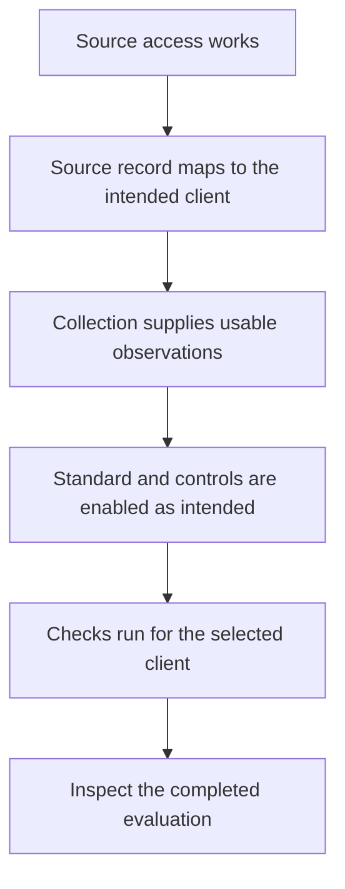

Start with **one client and one control**. Record the status, detailed reason and evaluation time before changing anything. This gives you a stable starting point and makes it possible to explain why a later result differs.

## Choose what you see

| Symptom | Start here |
| --- | --- |
| A source is connected, but there are no results. | [Check the path to evaluation](#connected-but-no-results). |
| The control says **Not covered**. | [Check whether evidence can be supplied](#not-covered). |
| The control says **No data**. | [Find the missing or unusable observation](#no-data). |
| A pass or failure looks wrong. | [Reconstruct the comparison](#an-unexpected-pass-or-failure). |
| The control is unexpectedly **Not applicable**. | [Check enabled states and overrides](#unexpectedly-not-applicable). |
| API or MCP access is denied. | [Check the credential and permissions](#api-or-mcp-access-denied). |

## Connected, but no results

A working connection is the first step in a longer path:



Find the first step you cannot confirm:

1. Check connection health and source access in [Integrations](/guides/integrations).
2. Confirm the source record's identifier maps to the intended [Organization](/guides/organizations).
3. Check whether collection completed and produced observations for that client.
4. Review the standard and control settings. A copied library template starts disabled.
5. Use **Standards → Run checks**, review the selected clients and settings, and inspect the completed evaluation.

**Recovery check:** a result exists for the intended client and control, and you can identify when it was evaluated. It need not pass for this workflow to be working.

## Not covered

Read the detailed reason and identify the missing predicate: the kind of observation the control needs.

- Look up its meaning in the [predicate reference](/guides/predicate-reference).
- Confirm that an available source can supply it in this deployment and client context.
- Check the relevant integration and client mapping.
- Review existing evidence as well: existing observations can affect coverage reconciliation, while freshness still matters.

An RMM connection supplying device check-ins cannot be assumed to supply account MFA registration. Adding an unrelated integration will not answer the missing question.

**Recovery check:** the required evidence path is established and a new evaluation reflects it. If suitable automation is unavailable, keep that limitation visible and consider a separate [manual check](/controls/manual-checks) for the broader question.

## No data

Use the result's detailed reason to narrow the investigation.

<AccordionGroup>
  <Accordion title="The selected population is empty">
    Check that the population predicate has observations for this client. Compare any exact population value with the actual value, including type and spelling. Review filters for unintended exclusions.

    **Recovery check:** the expected subjects appear, or the reason they are outside this population is understood. An empty observed population is not proof that no relevant accounts or devices exist.
  </Accordion>
  <Accordion title="A selected subject is missing a required observation">
    Confirm that the population observation and expected observation refer to the same account, device or workload. Inspect source permissions, completed collection and the source's ability to provide that property.

    **Recovery check:** a fresh, eligible observation answers the question, or the remaining gap has a specific cause and owner. Missing is not false, zero or an observed null value.
  </Accordion>
  <Accordion title="Evidence exists but is too old or unusable">
    Inspect observation times and the detailed status reason. If the source has stopped collecting, restore collection and confirm new evidence arrived before running checks again.

    **Recovery check:** both the observation time and the subsequent evaluation show that new evidence was considered. Re-running a check alone does not refresh the source evidence.
  </Accordion>
  <Accordion title="A filter needs evidence that is missing">
    A filter decides which subjects are assessed. Missing filter evidence can prevent a complete pass. Check the filter's required observation and whether the filter expresses your intended scope.

    **Recovery check:** the scope can be established from evidence. Do not remove a meaningful filter merely to obtain a different badge.
  </Accordion>
</AccordionGroup>

## An unexpected pass or failure

Reconstruct the question before changing the answer:

| Check | What to compare |
| --- | --- |
| Client and subject | Are the observations about the intended client and the same account, device or workload? |
| Population | Does the control include the intended subjects? Did a filter exclude something important? |
| Actual value | What did the source report, and with what type? Boolean `true` differs from the text `"true"`. |
| Comparison | Is the operator asking the intended question? “At most five” includes five. |
| Effective settings | Is a client override changing the threshold? Is the parent standard enabled? |
| Time and eligibility | Are the observations suitable for this evaluation? Are there unexpected future timestamps? |

A known failure can coexist with missing evidence for another subject. Likewise, a pass only establishes the selected expectation against the assessed evidence.

**Recovery check:** you can state the actual value, effective expectation and evidence that explain the result. If you intentionally changed the definition or threshold, record that the question changed.

For worked examples, follow the [administrator assessment](/journeys/read-your-first-result), [vulnerability limit](/controls/recipes/vulnerability-limit) or [backup recipe](/controls/recipes/backup-confidence).

## Unexpectedly not applicable

Review the parent standard's enabled state, the control's enabled state and the client's override. A disabled parent standard forces the control off even if a client setting requests it on.

Confirm that any exclusion is intentional. See [parameters and client overrides](/controls/parameters) for the editing and reset workflow; **Reset to standard** restores value and enablement defaults.

**Recovery check:** effective scope matches the agreed client expectation, and a subsequent evaluation reflects it. An excluded check is not a passing check.

## API or MCP access denied

For authentication failures, check the bearer header, expiry and revocation. For denied operations, check the key's exact scope and its owner's current permissions. Confirm the client identifier too; inaccessible resources may be reported as not found.

Use [API authentication](/api-reference/authentication), [API errors](/api-reference/errors) or [MCP connection troubleshooting](/mcp/connect#troubleshoot). Do not paste credentials into a support request or try broader permissions without identifying the required operation.

## Before you escalate

Collect enough context for another person to reproduce the investigation:

```text
Client and control identifiers:
Status and detailed reason:
Evaluation time (UTC):
Expected behaviour:
Observed behaviour:
Source and relevant observation times:
Effective parameters or override:
Checks already performed:
Safe error message or reference:
```

Exclude API keys, secrets and unnecessary personal data. Share evidence references only with people authorised to access them.

## Confirm the recovery

Collect fresh evidence where needed, run checks again and inspect the new evaluation. Confirm the result changed for the expected reason, and keep unrelated failures and unknowns visible.

**You should now have:** either an explained result backed by evidence, or a specific unresolved gap with the next investigation and owner identified.
