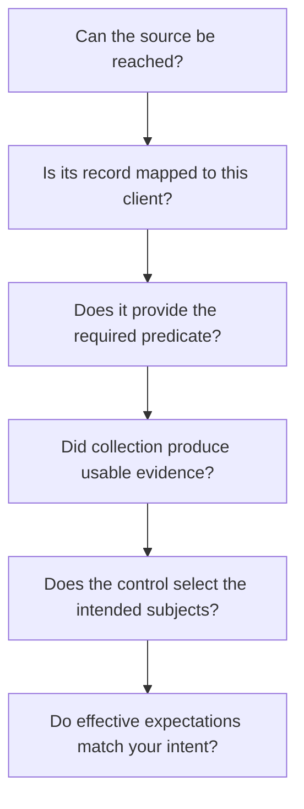

Start with one client and one control. Record the status, detailed reason and evaluation time before changing configuration. This keeps a source problem from being mistaken for a control problem.

## Choose the symptom

| What you see | Check first | Read next |
| --- | --- | --- |
| Integration connected, but no results | Client mapping, collection completion and applied standard. | [Integrations](/guides/integrations) |
| `not_covered` | Missing predicates and whether a source supplies them. | [Predicate reference](/guides/predicate-reference) |
| `no_data` | Missing facts, empty population, unknown filters and freshness. | [Control results](/guides/control-status) |
| An unexpected failure | Actual value, operator, threshold and selected subjects. | [Control conditions](/guides/control-conditions) |
| An unexpected pass | Evidence scope, effective parameters, timestamps and whether the control asks the right question. | [Evidence](/guides/evidence) |
| `not_applicable` unexpectedly | Enabled state and client overrides. | [Standards](/guides/standards) |
| API or MCP permission denied | Key scopes and the owner's current permissions. | [Authentication](/api-reference/authentication) |

## A connected source is not enough

Check each question in order. For example, an RMM connection may supply check-in evidence but cannot be assumed to supply identity MFA registration evidence.

## Example: backup protection looks healthy

A `backup_protected_by` observation shows that a product reports protection. If the question is “Did a backup succeed recently?”, inspect `backup_last_successful_at` and the intended job or workload. If the question is “Can we restore this system?”, a product-presence observation or successful-job timestamp cannot replace a restore test.

Fix the question or evidence requirement instead of changing a threshold merely to obtain a green result.

## Example: nobody appears in the population

Check that the anchor predicate exists for this client, that its object matches the actual observed value, and that filters are not excluding the intended subjects. An empty observed population must not be interpreted as proof that no relevant accounts or devices exist.

## After a fix

Collect fresh evidence where needed, re-evaluate the control and check the new evaluation time. Confirm that the result changed for the expected reason. Keep unrelated failures and unknowns visible.

When escalating, share the client/control identifiers, evaluation time and safe error or source details. Do not include API keys, secrets or unneeded personal data.
