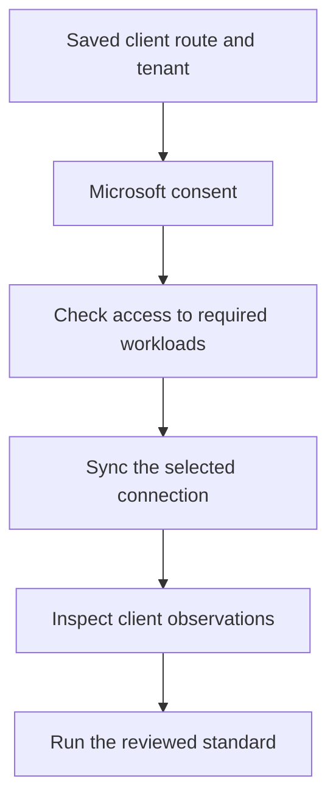

Use this guide to prepare the Microsoft side of a connection. Then follow [Microsoft connections for each client](/guides/client-microsoft-connections) for Alignr's default, override and mapping controls.

For a first client, **Direct** is the route when the client is outside your partner relationship. **Partner Center** uses your MSP's delegated customer access. Intune device evidence currently uses Direct.

## Gather the prerequisites

- The client's Microsoft tenant ID and the matching Alignr client. When adding a Microsoft or Partner Center connection, the **Add connection** form can look up that connection's tenant ID from its Microsoft domain; check the returned tenant before using it.
- An Alignr account with `integration.read` and `integration.manage`, plus access to the client.
- For Direct, a client administrator authorised to grant the requested application permissions.
- For Partner Center, an authorised partner user with MFA, an active customer relationship, the relevant GDAP role assignments and customer application consent.
- Licences for the Microsoft workloads being assessed. For example, reading `signInActivity` requires Entra ID P1 or P2 as well as `AuditLog.Read.All`; an accessible user list does not establish this capability. [Microsoft's user API requirements](https://learn.microsoft.com/en-us/graph/api/user-list?view=graph-rest-1.0).

**GDAP** means granular delegated admin privileges. A partner relationship, application consent and the delegated user's assigned roles are separate prerequisites. Microsoft's [GDAP application guidance](https://learn.microsoft.com/en-us/partner-center/developer/gdap-and-secure-application-model) explains that relationship.

## Choose the permission model

| Route | How access is granted | What to review |
| --- | --- | --- |
| Direct | Application permissions consented in the client tenant. Collection uses an application token. | Correct client tenant, application identity and requested Graph application permissions. |
| Partner Center | Partner sign-in plus customer delegated Graph consent and GDAP access. | Partner tenant, customer assignment, consented delegated permissions and the partner user's customer roles. |

Microsoft treats application permissions differently from delegated permissions even when their names are identical. Do not add delegated grants to a custom Direct application and expect application-token collection to work.

### Alignr's two platform applications

When the deployment offers shared Microsoft applications, **Direct** and **Partner Center** use separate registrations in Alignr's Microsoft tenant. The Direct registration uses Graph **application** permissions for a client administrator to consent in that client's tenant. The Partner registration uses **delegated** Graph permissions and Partner Center delegated `user_impersonation` for an MFA-protected partner account. The Partner registration has no application permissions; it does not use the Direct registration as a fallback.

The registrations share the production callback `https://api.alignr.io/api/v1/integrations/microsoft/oauth/callback`, but have different client IDs and secrets. This is deployment setup, not a step where every MSP must create two registrations. If a route says its shared application is unavailable, ask your deployment administrator to configure that route before authorising it. A custom Direct registration remains a separate option for a client that needs one.

## Direct: authorise the intended client

<Steps>
  <Step title="Select Direct in Alignr">
    Open **Clients → select client → Connections → Microsoft setup**. Set **Connection method** to **Direct**, enter the client's **Microsoft tenant ID**, then **Save preference**.
  </Step>
  <Step title="Prepare the selected application">
    Under **Authorise this client directly**, use the Alignr application unless your deployment requires a custom registration. Select **Set up direct connection** to prepare the Entra and Intune connections.

    If the shared application is unavailable, ask the deployment administrator to configure it or use the supported custom-application option. Creating an Alignr client does not configure a Microsoft application.
  </Step>
  <Step title="Review and grant consent">
    Select **Authorise Microsoft**. Confirm that Microsoft's screen identifies the intended client and application, and review the requested access before approving it.

    The approver must be able to consent to Graph **application** permissions. Microsoft lists **Privileged Role Administrator** for granting any API permission; Application Administrator or Cloud Application Administrator alone does not cover Microsoft Graph application roles. Use an appropriately authorised role under your organisation's policy. [Microsoft admin-consent prerequisites](https://learn.microsoft.com/en-us/entra/identity/enterprise-apps/grant-admin-consent).
  </Step>
  <Step title="Probe the available workloads">
    Return to Alignr and select **Check access**. Review each available and unavailable capability. Follow **Check Microsoft Intune access** for device coverage.

    The consent return verifies the selected tenant and authorisation ceremony. It is not a full workload test. A sample that passes does not prove access to every user or mailbox.
  </Step>
</Steps>

### Direct read-permission reference

For the read families used by the current collectors, review these Graph **application** permissions on the Direct registration. This is a preparation reference, not a claim about the exact grants configured on your deployment's shared Direct application. The Microsoft consent screen and saved application grants remain the record of what is actually requested and approved.

| Read family | Application permission | Microsoft reference |
| --- | --- | --- |
| Tenant identity | `Organization.Read.All` | [Organization](https://learn.microsoft.com/en-us/graph/api/organization-get?view=graph-rest-1.0) |
| User attributes | `User.Read.All` | [Users](https://learn.microsoft.com/en-us/graph/api/user-list?view=graph-rest-1.0) |
| Directory role membership | `RoleManagement.Read.Directory` | [Role members](https://learn.microsoft.com/en-us/graph/api/directoryrole-list-members?view=graph-rest-1.0) |
| Subscribed products used to interpret assigned licences | `Organization.Read.All` (already listed above) | [Subscribed SKUs](https://learn.microsoft.com/en-us/graph/api/subscribedsku-list?view=graph-rest-1.0) |
| Verified domains | `Domain.Read.All` | [Domains](https://learn.microsoft.com/en-us/graph/api/domain-list?view=graph-rest-1.0) |
| Sign-in activity and authentication registration report | `AuditLog.Read.All` | [Registration report](https://learn.microsoft.com/en-us/graph/api/authenticationmethodsroot-list-userregistrationdetails?view=graph-rest-1.0) |
| Conditional Access policies | `Policy.Read.All` | [Policies](https://learn.microsoft.com/en-us/graph/api/conditionalaccessroot-list-policies?view=graph-rest-1.0) |
| Mailbox settings | `MailboxSettings.Read` | [Mailbox settings](https://learn.microsoft.com/en-us/graph/api/user-get-mailboxsettings?view=graph-rest-1.0) |
| Intune managed devices | `DeviceManagementManagedDevices.Read.All` | [Managed devices](https://learn.microsoft.com/en-us/graph/api/intune-devices-manageddevice-list?view=graph-rest-1.0) |
| Intune compliance configuration | `DeviceManagementConfiguration.Read.All` | [Compliance policies](https://learn.microsoft.com/en-us/graph/api/intune-deviceconfig-devicecompliancepolicy-list?view=graph-rest-1.0) |

Microsoft lists `LicenseAssignment.Read.All` as the least-privileged application permission for subscribed SKUs, and also accepts `Organization.Read.All`, which this Direct registration already needs. Some APIs accept broader alternatives; do not add broad write access to solve a read-coverage gap. Microsoft documents `AuditLog.Read.All` for the registration report. `Reports.Read.All` alone is not the documented permission for that endpoint. The report also does not work for disabled users, so absence of a row is not proof of no registration.

For a custom application, review its **API permissions** in Microsoft Entra, choose the appropriate application permissions and grant authorised admin consent. Supply its **Application client ID** and **Application secret** through Alignr's custom-application form. The custom registration must also support the consent callback configured for your Alignr deployment; obtain that exact callback from the deployment administrator rather than inventing one.

## Partner: authorise the MSP, then the customer

1. In **Settings → Microsoft**, choose **Partner Center · use your partner account**, select or add the partner connection and **Save Microsoft defaults**. When adding a connection, **Find tenant ID by domain** can look up your MSP partner tenant's ID from its Microsoft domain: enter the domain, select **Look up tenant**, confirm the result and select **Use tenant ID**. Public metadata does not prove tenant ownership or grant access. This route requires the separate Partner platform application when using Alignr's shared registration; Direct application credentials cannot replace it.
2. Select **Request admin consent**. Review Microsoft's screen with an administrator of your MSP partner tenant. Returning to Alignr records only that the consent flow returned; it does not verify a grant or customer access. If the return fails, correct the problem and start this step again.
3. Select **Authorise partner account** and sign in to the intended MSP partner tenant with MFA. This separate delegated authorisation requests Partner Center `user_impersonation`, `offline_access`, and Graph `User.Read` / `User.Read.All` for the MSP staff-directory preview. It is not customer Graph consent. [Partner Center authentication](https://learn.microsoft.com/en-us/partner-center/developer/partner-center-authentication).
4. Review and assign the customer's tenant to its Alignr client. Use that customer's tenant ID, not the MSP partner tenant ID entered for the partner connection.
5. Open the client's **Connections**, confirm the saved Partner Center route and tenant ID, open **Sites and Microsoft access**, then select **Check access**.
6. Review the result. This action checks access and can request missing customer read consent where authorised; it does not create GDAP relationships or grant the partner user new customer roles.

On a client page, **Check access** checks only the Microsoft tenant linked to that client. From the connection page, it checks the selected customers. An explicit **Collect now** request also prepares access for the selected customers before collection. Where your partner account is authorised to do so, these actions request missing customer app consent through Partner Center. Scheduled collection does not create new consent grants.

If the app grant has already been accepted for the same customer, application and saved assignment, a remaining optional capability gap does not cause repeated consent requests. The unavailable capability remains visible so you can review its GDAP roles, licensing or workload availability. Changing the assignment or application requires a fresh check.

The current customer-consent request contains these delegated Graph permissions:

```text
User.Read
User.Read.All
RoleManagement.Read.Directory
LicenseAssignment.Read.All
Domain.Read.All
AuditLog.Read.All
Policy.Read.All
MailboxSettings.Read
```

The Partner platform registration also needs Partner Center delegated `user_impersonation` and `offline_access`. It has no Graph or Partner Center application permissions. Your MSP's partner account, customer consent and GDAP roles still determine which customers and workloads are accessible.

The assigned GDAP roles must also permit the workload reads. For example, the registration-report API documents delegated roles including Reports Reader, Security Reader, Security Administrator and Global Reader. A consented scope alone is insufficient. Partner Center does not collect mailbox type, time zone or automatic replies. Those tenant-wide reads require a Direct Microsoft application connection with mailbox permission. A missing mailbox capability does not block supported identity evidence.

## Complete the evidence loop



Each arrow is a task to complete, not an automatic trigger. Use **Collect now** on the relevant integration and inspect **Collection history**. Then inspect current observations for a known client account or device and run the standard.

## Resolve the specific gap

| What you see | Next action |
| --- | --- |
| Consent denied or the administrator cannot approve. | Check the approver's Microsoft role and requested permission type. Restart authorisation after the prerequisite is resolved. |
| Wrong tenant or ambiguous assignment. | Compare the client tenant ID, connection and reviewed mapping. Do not authorise your MSP tenant for a Direct client. |
| Expired or already-used authorisation attempt. | Start again from Alignr; do not reuse the old callback link. |
| Partner sign-in succeeds but customer access fails. | Review customer consent, GDAP role assignments and the exact selected customer. |
| Users are available but sign-in activity is missing. | Check `AuditLog.Read.All`, the client licence and the availability of the property; do not substitute an assumed date. |
| Intune capabilities unavailable through Partner Center. | Use the client's Direct route for the currently supported device checks. |
| Access checks pass but no assessment exists. | Collect evidence, inspect it and run controls. Consent and access checks do not run the assessment. |

**Finish when:** the selected tenant is correct, required workload access has been checked, fresh observations are visible and the resulting assessment can be traced to them. These instructions combine current Alignr behaviour with Microsoft's published requirements; they do not certify access in your tenant without those checks.
