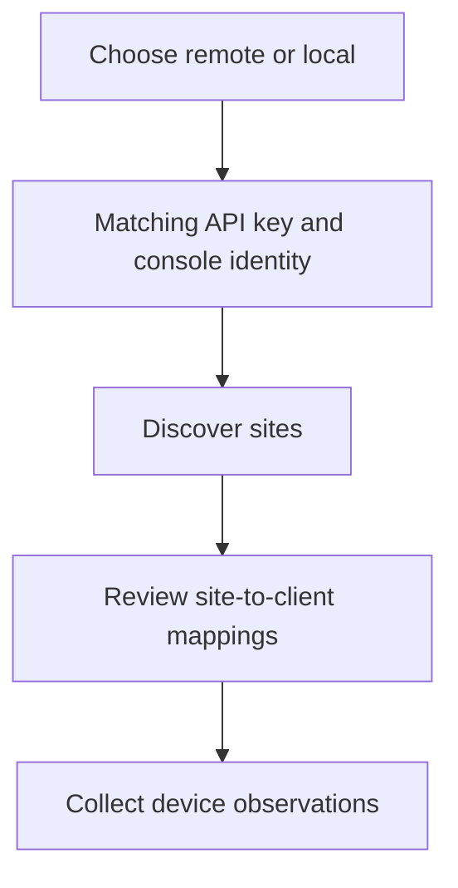

UniFi Network supplies device role, model, IP address, reachability, firmware, available-update and uplink observations. Choose how Alignr will reach the console before preparing credentials.

## Choose the connection mode

| | Remote through UniFi cloud | Direct to the local console |
| --- | --- | --- |
| **API key** | A UniFi cloud API key for the account with console access. | The console's own Network integration API key. |
| **Console ID (remote)** | Enter the complete host ID, including a suffix such as `:123456` when present. | Leave blank. |
| **Console URL (local)** | Leave blank. | Enter the console's reachable HTTPS base URL. |
| Network prerequisite | The console must be accessible through the cloud account. | The Alignr deployment must be able to reach the console, not merely your browser. |

The two keys are different. A cloud key is not interchangeable with a console-local key. If both console fields are filled, **Console ID wins** and the local URL is ignored.

Use [UniFi's Network API getting-started documentation](https://developer.ui.com/network/v9.4.17/gettingstarted) to prepare a key for the intended environment. Review the API support of your installed Network version.

## Configure Alignr

<Steps>
  <Step title="Prepare the account and console identity">
    For remote access, obtain the cloud host ID from the console URL or the cloud hosts API. Preserve the full ID. For local access, confirm the console management URL is reachable from the Alignr deployment.

    `https://unifi.ui.com` is the cloud portal, not a local console URL.
  </Step>
  <Step title="Add the connection">
    Open **Integrations**, add **UniFi Network**, and choose a descriptive **Connection name**. Enter **API key** and the one console field for your chosen mode. Review the saved connection outcome.
  </Step>
  <Step title="Assign the sites">
    Open **Clients & sites**, select **Refresh sites**, then assign each site to its intended client. UniFi site IDs are the mapping identifiers in both modes; the console itself can contain several clients' sites.
  </Step>
  <Step title="Collect and inspect">
    Select **Sync now**, inspect **Sync history**, and check one mapped client's device observations. Compare the device, source and observation time before running a standard.
  </Step>
</Steps>

The connection authenticates a console; the site mapping decides which client receives each site's evidence.

## Common setup problems

| Symptom | Check |
| --- | --- |
| Authentication fails with a valid-looking key. | The key must match remote or local mode. Check which console field is selecting the mode. |
| Local console works in your browser but not in Alignr. | Check routing and reachability from the Alignr deployment. |
| Remote console cannot be found. | Check the cloud account's access and full host ID, including any suffix. |
| Site is missing. | Refresh sites and inspect the returned identifiers and connection outcome. |
| Evidence appears under the wrong client. | Review the site assignment before changing the control. |

## What this source does not prove

A device being online does not prove its security configuration is acceptable. An available firmware update does not establish whether an upgrade is safe to apply. UniFi does not supply the RMM-management predicate; a missing RMM observation is not fixed by reconnecting UniFi.

**Checkpoint:** the correct mode authenticates, each relevant site is mapped deliberately, and one client's current device observations match its environment.

[Maintain this connection](/guides/maintain-integrations) or [choose network controls](/controls/baselines/network).
