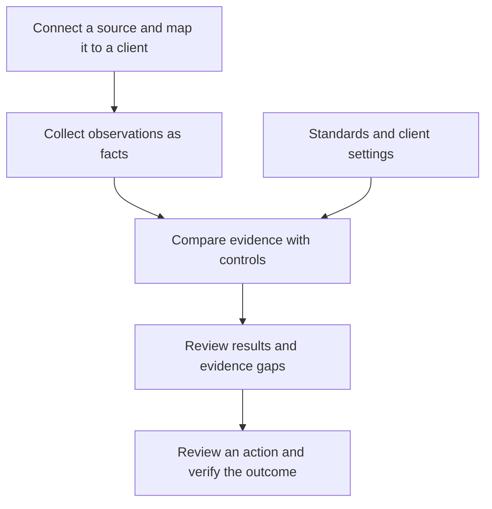

Alignr helps managed service providers assess their clients' environments against technical standards. It brings together observations from connected systems, checks them against your expectations, and shows the evidence behind each result.

Your **workspace** belongs to your MSP. An **Organization** is one of your clients within that workspace.

<CardGroup cols={2}>
  <Card title="Take the guided journey" icon="route" href="/journeys/first-assessment">Follow one client from source connection to an explained result, with checkpoints at each stage.</Card>
  <Card title="Set up your workspace" icon="rocket" href="/guides/setup-wizard">Use the in-app wizard to connect tools, invite your team and choose standards.</Card>
</CardGroup>

Evaluating Alignr for your MSP? [Run a focused pilot](/journeys/evaluate-alignr) with one client, explicit checkpoints and a decision about what to expand.

Prefer to see the app first? [Take the visual tour](/journeys/visual-tour), with annotated demo screens. For procurement questions, read [Security and your data](/guides/security-and-data) and [Billing and support](/guides/billing-and-support).

## Find your way around the app

The left sidebar groups **Overview**, **Issues**, **Reviews** and **Activity** for daily work, with **Clients**, **Standards** and **Integrations** under **Workspace**. **MCP** and **Settings** are under **Manage**. Items are shown according to your permissions. The top-left workspace menu opens workspace settings and links to **Team members** and **Billing** when your role permits. The same menu also contains **Account settings** and **Sign out** for your personal account. The workspace client selector scopes supported pages without changing saved client assignments.

Use the toolbar search, **Ask Alignr** when permitted, and **Colour theme**. Choose **Dark**, **Light** or **System**; Alignr remembers your choice. On a narrow screen, open **Open navigation** for the same workspace destinations. The workspace and personal-account actions are grouped in that same menu.

## How to use these docs

Start with [the setup wizard](/guides/setup-wizard) to configure your workspace, then follow [Your first client assessment](/journeys/first-assessment) if you are new to Alignr. It teaches the workflow using one consistent example. The [quickstart](/quickstart) is the shorter checklist for returning users.

Everything you need to use the app is under **Documentation**. Expand a group in the left sidebar to find its guides:

- **Your first assessment** — a guided path with examples, checkpoints and recovery steps.
- **Set up your workspace** — configure clients, choose Microsoft access and build or import standards.
- **Connect your tools** — choose an integration, follow its setup guide, maintain credentials and run domain checks.
- **Manage your workspace** — manage accounts, invite teammates, recover access, configure settings and check Workspace health.
- **Day-to-day work** — review the dashboard, triage issues, approve supported fixes, use Ask Alignr and complete client reviews.
- **Reports and client portal** — prepare saved reports and share the right information with client audiences.
- **Understand assessments** — learn how evidence becomes a result and what to do next.
- **Controls** — browse baselines by category, create custom controls and manage manual checks. Open **Build and manage controls** for practical guides or **Control definitions** for technical details.
- **Help and reference** — troubleshoot a result or look up an unfamiliar term or predicate.

On mobile, open the navigation menu below the logo to see the same groups. Use search for a specific control name or technical identifier. Reference catalogues are there to look things up; you do not need to read them end to end.

**API reference** and **MCP** are separate tabs for developers and people connecting AI assistants. You do not need an API key or MCP connection to use the Alignr app.

Already set up? Use [Your daily review](/guides/daily-review) as a repeatable route from Overview to owned follow-up. Preparing a client meeting? Follow the [meeting playbook](/journeys/client-meeting), from reviewing evidence to recording decisions and verifying delivery.

## How Alignr fits together

A connected source supplies **facts**: observations about an account, device or other item. A **predicate** names the observed property, such as whether MFA is registered.

A **control** compares those observations with an expectation. A **standard** groups related controls, and client settings can adjust their thresholds. **Manual checks** capture human reviews where automated observations cannot answer the whole question.

Results show whether an expectation is satisfied, contradicted or cannot yet be assessed. Missing or stale evidence does not count as passing. A supported remediation plan is reviewed separately before a change is made.

## Follow one example

For a client called Acme, a directory source reports that an account is a Global Administrator and has MFA registered. An identity control selects that administrator and checks the MFA observation.

The observed registration satisfies that comparison. It does not establish that every sign-in enforces MFA; policy coverage needs its own review. If the registration observation is missing, Alignr needs more evidence to answer the question.

This is the connection between the setup guides, evidence guides and control reference: **which client, which observation, which expectation, and what conclusion follows?**

## Choose your path

<CardGroup cols={2}>
  <Card title="Set up your first client" icon="rocket" href="/journeys/first-assessment">Follow the guided journey from source connection to an explained assessment.</Card>
  <Card title="Understand a result" icon="magnifying-glass" href="/guides/control-status">Read the outcome, inspect evidence and investigate gaps.</Card>
  <Card title="Choose or build controls" icon="sliders" href="/controls/overview">Start with a baseline or define your own technical expectations.</Card>
  <Card title="Build with the API" icon="terminal" href="/api-reference/introduction">Read workspace data from your own tools using a scoped key.</Card>
</CardGroup>

Want help inside the app? [Use the AI assistant](/guides/ask-alignr) to explain evidence and draft reviewed configuration changes.

Connecting an external AI assistant? Start with [MCP explained](/mcp/introduction), then follow the [connection guide](/mcp/connect).

Something unclear or missing? [Tell us which page and task need improvement](mailto:support@alignr.io?subject=Alignr%20documentation%20feedback). Include what you expected to find; leave credentials and client records out of the message.
