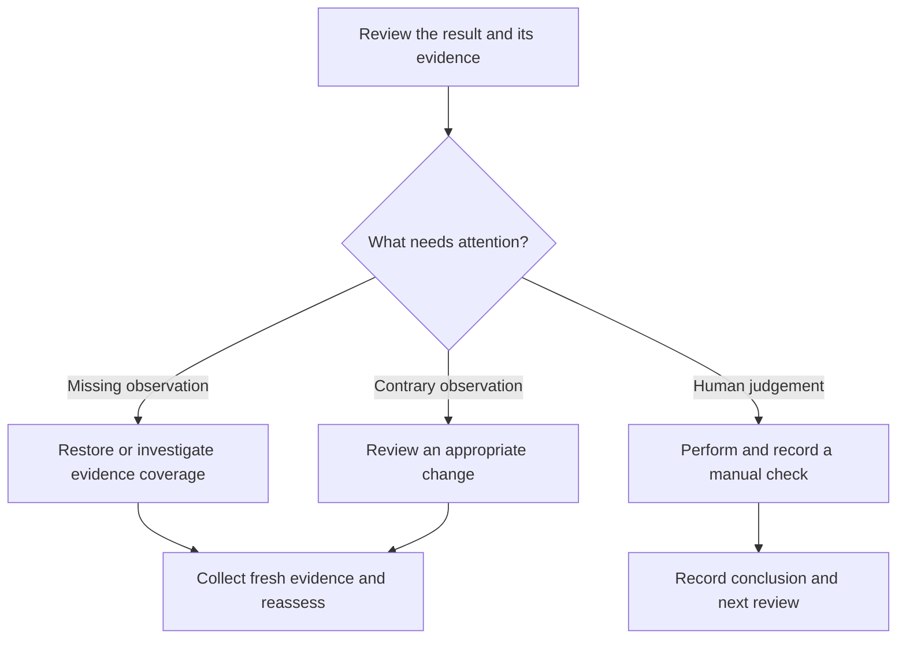

**Journey:** [Overview](/journeys/first-assessment) → [Establish evidence](/journeys/connect-and-map) → [Assess](/journeys/read-your-first-result) → **Follow up**

An assessment is useful when it leads to an appropriate next action. In our Acme example, Morgan's registration failure and Sam's evidence gap need different responses.

## Choose the right follow-up



An evidence gap calls for investigation of the evidence path. A supported failure may call for a change. A manual review answers a question the automated observation cannot settle.

## Follow Morgan's failure

1. Confirm Morgan's account, source observation and business purpose.
2. Identify an appropriate supported change and its owner. Review risk and required approval.
3. Carry out the approved action through the supported workflow. If Alignr has no supported action for this finding, use your approved operational process.
4. Collect fresh evidence and run checks again.
5. Confirm the new result is supported by a new observation, rather than assuming that submitting a change fixed the issue.

See [remediation and verification](/guides/remediation) for autonomy and approval rules.

## Follow Sam's evidence gap

Check the connected source, requested permissions, completed collection, client mapping and account identity. Determine whether this source can actually supply the missing observation.

**Checkpoint:** either fresh evidence now supports an assessment, or the remaining gap has an explicit cause and owner. A disabled control is not evidence that the underlying expectation has been met.

## Review effective MFA enforcement separately

Registration does not answer whether policies enforce MFA for the required sign-ins. The identity template includes manual reviews for broader policy and governance questions.

Use a [manual check](/controls/manual-checks) to record what was reviewed, the evidence, the conclusion and follow-up. Set a suitable review cadence. Manual assessments retain their own status and do not change the automated live score.

## A handover someone can act on

Use this outline in your approved record or ticket:

```text
Client and control:
Assessment time:
Population assessed:
Evidence references and observation times:
Conclusion:
Coverage gaps or limitations:
Next action and owner:
Approval required:
Verification evidence:
Next review:
```

Keep sensitive data and credentials out of the handover. Use evidence references accessible to the intended reviewer.

## You have completed the journey

You can now trace a result from the client and source through the expectation to an owned follow-up. You have also seen why a known failure, missing evidence and a human review are different kinds of work.

<CardGroup cols={2}>
  <Card title="Build a custom control" icon="sliders" href="/controls/recipes/overview">Apply the same approach to encryption, vulnerability counts or backup recency.</Card>
  <Card title="Explore another baseline" icon="layer-group" href="/controls/baselines/overview">Choose another topic and review its evidence requirements before rollout.</Card>
</CardGroup>
