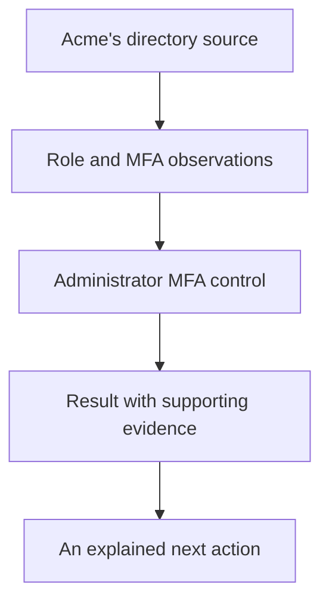

By the end of this journey, you will be able to explain **which client was assessed, what was expected, what the evidence showed, and what happens next**.

We follow **Acme**, a fictional client of your MSP. Names and observations in this journey are illustrative. Follow the workflow with an authorised client in your own workspace; do not import the example observations as production evidence.

New workspace? Start with [the setup wizard](/guides/setup-wizard) to connect tools, invite teammates and choose a draft baseline. Return here to work through a result.

## What you need

- Access to an Alignr workspace and permission to manage integrations, clients and standards.
- A directory source that can supply role membership and MFA registration observations.
- Authority to connect that source and confirm its client mapping.

An API key is not required. If you need to finish workspace setup first, use the [quickstart](/quickstart).

## The route

<CardGroup cols={2}>
  <Card title="1. Establish the evidence" icon="plug" href="/journeys/connect-and-map">Connect the source, map Acme and confirm that the observations describe the right client.</Card>
  <Card title="2. Run and explain the assessment" icon="clipboard-check" href="/journeys/read-your-first-result">Choose the identity template, run checks and work through pass, fail and missing evidence.</Card>
  <Card title="3. Decide what happens next" icon="list-check" href="/journeys/close-the-loop">Separate evidence gaps from remediation, record human reviews and verify the outcome.</Card>
  <Card title="Then: build your own" icon="sliders" href="/controls/recipes/overview">Use a worked recipe to add a focused expectation to an editable standard.</Card>
</CardGroup>

## The question we will answer

**Do Acme's observed Global Administrators have MFA registered?**

This question has three parts:

| Part | In this journey |
| --- | --- |
| Client | Acme, represented by an Organization in your MSP workspace. |
| Population | Accounts observed holding the Global Administrator role. |
| Expectation | Each selected account has an MFA registration observation equal to true. |

This checks registration. Whether every sign-in enforces MFA is a separate policy question.

The same client and account identities must be carried through every stage. A result is useful when you can trace it all the way back to the observation.

## Your finish line

You are done when you can answer these questions for one control:

1. Which client and accounts were included?
2. Which setting or condition was applied?
3. Which observations support the result, and when were they recorded?
4. What remains unknown?
5. Who owns the next action?

<Card title="Begin: establish the evidence" icon="arrow-right" href="/journeys/connect-and-map">Start with the source and client mapping.</Card>
